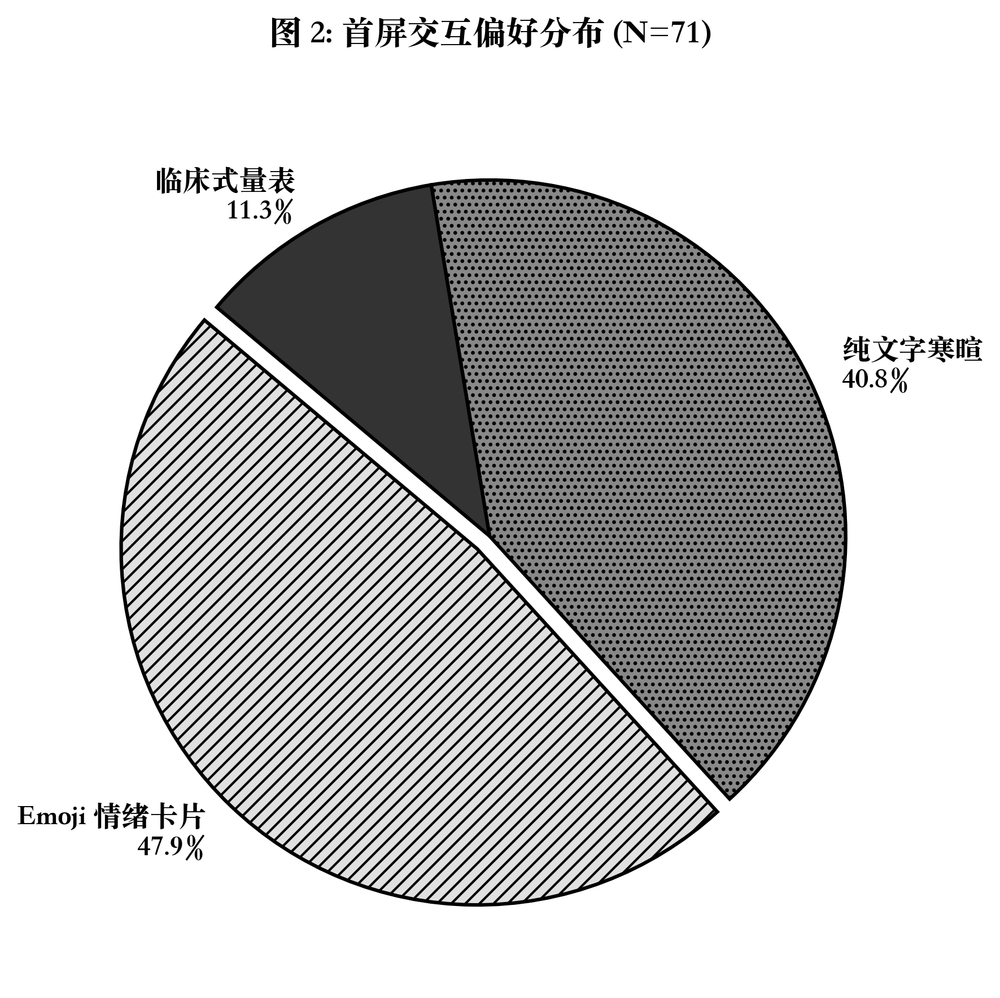
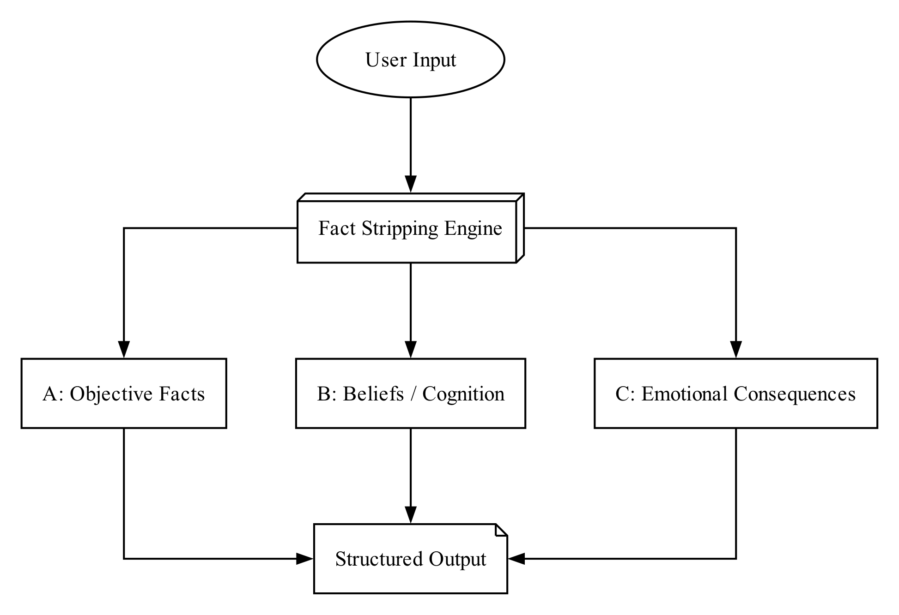
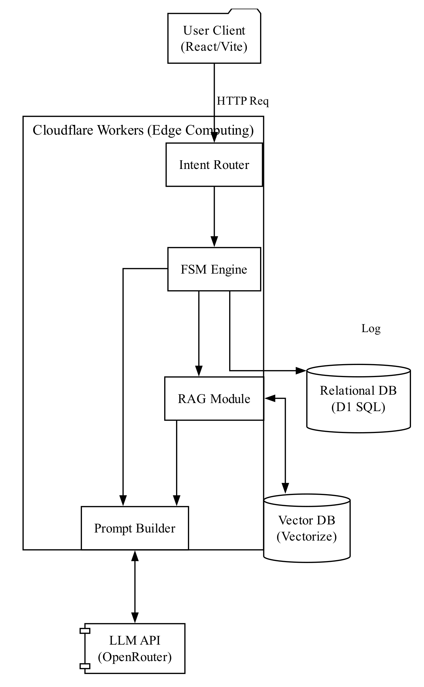
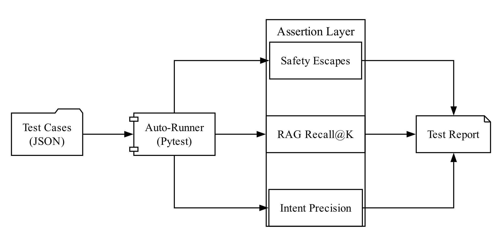

# 过程性证明材料

## 1. 项目演示视频
本项目（RE-THINK 心理支援 AI）的完整运行流程、前端界面交互及后端响应逻辑，已录制为实机演示视频。
视频已上传至在线平台，支持直接在线播放。

> **在线播放链接**：[此处插入您的视频在线链接，例如 Bilibili 或腾讯视频链接]
> **播放密码**：（如无密码请删除此行，如有请填写）

---

## 2. 过程性研发截图证明

为证明本项目的自主开发过程，以下提供各个阶段的核心工作截图记录。

### 2.1 需求调研与问卷分析
开发初期，我们进行了广泛的用户痛点调研，收集了真实问卷数据并进行了数据清洗与分析。

### 2.2 核心算法与流程设计
本项目的核心创新点“ABC 事实剥离引擎”的逻辑设计过程与系统架构定型。

### 2.3 前端界面 UI 开发
采用 React + Vite 框架开发的响应式疗愈视觉界面效果。

### 2.4 后端边缘计算部署
Cloudflare Workers 与 Vectorize 向量数据库的线上部署与链路连通状态。

### 2.5 自动化测试与验证
完成核心代码后，针对认知重塑与风险熔断机制进行的自动化测试与安全性验证。

