# 青少年心理支持智能体作品设计报告

**项目名称**：RE-THINK —— 基于认知行为疗法事实剥离与 RAG 安全边界的青少年心理支持智能体  
**参赛方向**：智能体应用方向  
**适用对象**：初中生、高中生及校园心理健康教育场景  
**开发者**：陈浩然（独立完成，AI 辅助协作开发）  
**AI 协作工具**：本项目的系统设计、代码实现、知识库构建、问卷调研及报告撰写均由开发者独立主导完成，过程中借助 AI 编程助手（Gemini / Claude）进行代码生成、架构讨论与文档整理方面的协作。

---

## 摘要

中学生的许多心理困扰并非以临床疾病的面貌出现，而是散落在日常的只言片语里——"考砸了觉得自己废了""同桌笑了一下肯定是在嘲讽我"。这些表达往往把客观事实和主观推断混在一起，而青少年在情绪激动时很难自行厘清二者的边界。

我们围绕这一问题，设计并实现了一套面向青少年的心理支持智能体原型 RE-THINK。系统以认知行为疗法（CBT）中的 ABC 模型为核心分析框架，借助大语言模型的自然语言理解能力，从用户的自由倾诉中分离可观察事实与主观信念，并据此提供结构化的情绪整理和小行动建议。在安全层面，我们构建了基于检索增强生成（RAG）的心理学知识库，引入 WHO、NICE、AACAP 等权威指南作为回应依据，并通过五态有限状态机实现了从破冰、倾听、事实剥离、认知重塑到危机熔断的分层干预流程。

为验证设计方向的合理性，我们面向 71 名真实中学生投放了定制化问卷调研。结果显示，73.2% 的受访者反感"模板化说教"，66.2% 厌恶"毒性正能量"，而在首屏交互方式的选择中，非文字的 Emoji 情绪破冰（47.9%）略胜于纯文字寒暄（40.8%），远超临床式评估量表（11.3%）。这些数据直接驱动了我们在交互设计上的关键决策。

需要强调的是，RE-THINK 不进行任何形式的心理诊断或治疗，其定位始终是校园心理健康教育体系中的辅助工具——帮助学生在求助专业人士之前，先把混乱的情绪理出一个头绪。

---

## 一、问题背景与需求分析

### 1.1 被忽视的"灰色地带"：不够严重、但足够痛苦

翻阅近年来关于青少年心理健康的文献和政策文件，一个反复出现的判断是：多数中学生的心理困扰远未达到临床诊断的门槛，但已经实实在在地影响了他们的学习状态、人际关系和自我评价（教育部等十七部门, 2023）。一个高一学生因为月考排名下滑而整夜失眠，一个初三女生因为好朋友突然和别人走得更近而觉得"全世界都抛弃了我"——这些困扰在临床意义上可能只是"适应性问题"，但对当事人来说，痛苦是真切的。

学校心理健康教育体系——包括心理课、心理老师、心理热线——在制度层面已经相对完善（教育部, 2012），然而在实际使用中存在一个明显的"门槛落差"：很多学生在最难受的时候，第一反应不是去找心理老师，而是"不知道怎么开口""怕被当成有病""只想有个人先听我说完"。换言之，在"独自消化"和"正式求助"之间，存在一段缺乏支持手段的灰色地带。

我们启动这个项目的初衷，就是试图在这段灰色地带中提供一个安全的、非评判的、随时可用的整理工具。

### 1.2 现有 AI 心理类产品的问题

在立项之前，我们试用了市面上若干 AI 心理陪聊产品和通用大模型的心理对话能力。总体感受可以概括为三个词：**像医生、像客服、像复读机**。

具体而言：

- **开场像问诊**：多数产品第一步就要求用户"给自己的焦虑打个分（1-5 分）"或填写标准化量表，这种临床式的起手极容易激发青少年的防御心理——"你是不是觉得我有病？"
- **回应像套话**：面对用户的倾诉，AI 的典型回应是"我能理解你的感受，你很勇敢"或"别难过，明天会更好"。这类"毒性正能量"（toxic positivity）在实际交互中不仅无效，反而让用户觉得"你根本没在听"。
- **缺少结构化能力**：通用大模型虽然能聊天，但很少能帮用户把一团乱麻般的情绪拆解清楚——哪些是确实发生的事，哪些是自己的推断，哪些是情绪放大后的灾难化预测。

这些观察后来在我们的问卷调研中得到了量化验证（详见 §1.3）。

### 1.3 面向真实用户的问卷调研

为了避免"闭门造车"，我们在系统设计之前，面向中学生群体投放了一份包含 13 道题的定制化问卷。问卷围绕五个维度展开：进入场景与情绪状态、破冰话术偏好、敏感提问容忍度、断点流失因子以及信任保障底线。为降低答题门槛，题目全部使用中学生日常用语撰写，避免心理学术语（详细问卷设计见附录）。

最终回收有效问卷 **71 份**，其中可确认为高中生的有 34 份（47.9%），其余未填写年级字段。地域覆盖上海、武汉、南昌、淮南等地及少量海外华人学生。以下是几个对系统设计影响最大的发现。

#### 发现一：中学生最反感的不是 AI 本身，而是 AI 的"说话方式"

在"你对 AI 心理产品的哪些体验最反感"这一多选题中（每人可选多项），结果分布如下：

| 痛点 | 选择人次 | 占比 |
|------|------:|-----:|
| 模板化回复（stiff_template） | 52 | 73.2% |
| 毒性正能量（toxic_positivity） | 47 | 66.2% |
| 不记得上文（no_memory） | 36 | 50.7% |
| 临床式问诊开场（clinical_survey） | 22 | 31.0% |
| 隐私焦虑（privacy_paranoia） | 22 | 31.0% |

**图 1. 用户痛点调研结果**

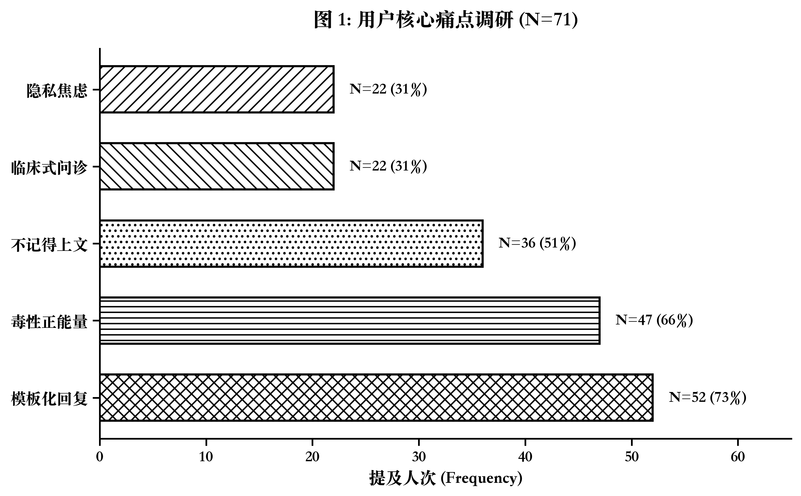

超过七成受访者把"模板化回复"列为首要反感项，"毒性正能量"紧随其后。这一结果直接影响了我们在 Prompt 工程中的核心约束：严禁使用"我理解你的感受""你很勇敢""明天会更好"等空洞安慰语，转而要求 AI 以接地气的日常口吻回应。

#### 发现二：Emoji 破冰的接受度高于预期

在"哪种首屏交互方式最能降低你的心理防线"这一单选题中：

| 交互方式 | 选择人数 | 占比 |
|----------|------:|-----:|
| Emoji 情绪卡片选择 | 34 | 47.9% |
| 纯文字社交寒暄 | 29 | 40.8% |
| 临床式评估量表 | 8 | 11.3% |

**图 2. 首屏交互偏好分布**


近半数受访者更倾向于"不用打字、点一下表情就能开始"的非文字入口。这与心理学中"高情绪负荷下认知资源紧张"的观点一致——当一个人正处于强烈负面情绪中时，组织语言本身就是一种额外负担（Beck, 2011）。这一数据成为我们设计"8-Emoji 全屏破冰"的直接依据。

#### 发现三：半数用户在深夜或私密场景中使用

求助场景的多选结果显示，排名前三的场景为：

- **极度隐私需求**（highly_private）：50.7%
- **深夜情绪低落**（midnight_emo）：49.3%
- **社交疲惫**（social_fatigue）：43.7%

这说明大量用户倾向于在独处、深夜、不愿让他人知道的情境下使用心理支持工具。这直接要求系统在隐私保护和即时可用性上做到足够好——不能有繁琐的注册流程，不能有外泄对话的风险。

#### 发现四：用户的开放反馈指向同一个核心诉求

在最后的开放题"你最希望心理 AI 对你说的话或建议"中，14 条有效反馈呈现出惊人一致的主题：

> "像人就行。"  
> "期待能更像人。"  
> "不是那种完全套话。"  
> "不要太套路化了，感觉每次都能猜到 AI 说什么。"  
> "可以更像真人实际对话而不是一味的安慰还有帮你分析，可以理性但不能太理性，要感性。"

一位有过抑郁就诊经历的高中生写了近 200 字的反馈，其中提到："deepseek 能很理性地分析，又能用很温暖的句子戳中人心，但是建议有些空泛……希望可以更人性化一点，因为用久了会发现，其实回答有一些模板化。"这些声音反复验证了一个判断：**中学生需要的不是一个会讲心理学术语的专家，而是一个真正在听、真正理解、说人话的朋友。**

### 1.4 从调研到设计：问题的再聚焦

综合文献梳理和问卷数据，我们将系统要解决的核心问题收敛为三条：

1. **表达门槛问题**：情绪激动时组织语言本身就是负担，需要一个"不用想怎么说就能开始"的入口。
2. **结构化能力问题**：用户的倾诉往往事实、推断、情绪混杂，需要帮他们"拆开看"而不是笼统地安慰。
3. **安全边界问题**：系统必须能识别真正的危机信号，在该转介的时候果断转介，而不是继续和用户"聊心理学"。

**图 3. 从问题到方案的映射**

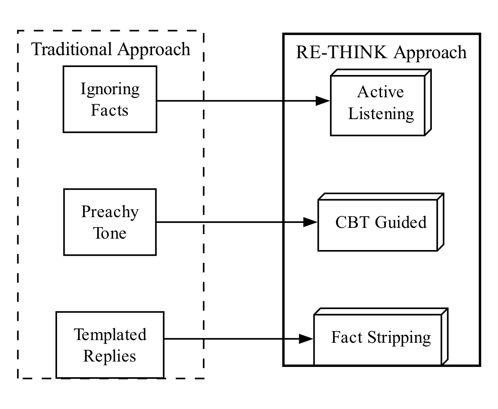

---

## 二、理论框架

### 2.1 为什么选择 CBT，而不是别的

在确定核心干预框架时，我们考察了三种在青少年心理健康领域有循证基础的治疗取向：

| 治疗取向 | 核心机制 | 适合场景 | 对 AI 实现的友好度 |
|----------|----------|----------|-------------------|
| CBT（认知行为疗法） | 识别并修正不合理的自动化思维 | 焦虑、抑郁、考试压力、人际困扰 | 高——逻辑链条清晰，可结构化执行 |
| DBT（辩证行为疗法） | 情绪调节、人际效能、痛苦耐受、正念 | 情绪调节困难、冲动行为、自伤 | 中——正念练习和人际技巧需要真人引导 |
| ACT（接纳承诺疗法） | 心理灵活性、与痛苦共存、价值导向行动 | 慢性疼痛、长期情绪问题 | 低——"接纳"和"价值澄清"高度依赖治疗关系 |

最终选择 CBT 作为主框架，理由有三：

第一，**结构化程度高**。CBT 的 ABC 模型（Ellis, 1962）和自动化思维记录（Beck, 1979）把"情绪困扰"拆解为"事件→信念→后果"三个环节，每个环节都有明确的操作步骤，天然适合用程序逻辑实现。相比之下，DBT 的正念练习和 ACT 的"认知解离"更多依赖体验式引导，很难由 AI 独立完成。

第二，**与青少年常见困扰高度匹配**。中学生最频繁的心理困扰——考试焦虑、同伴误解、自我否定——几乎都涉及典型的认知偏差（灾难化、非黑即白、读心术等）。CBT 对这些偏差有成熟的识别和干预方案（Beck, 2011; NICE, 2022）。

第三，**有充分的循证支持**。NICE 指南（2022）和 AACAP 实践参数均推荐 CBT 作为青少年焦虑和轻中度抑郁的首选心理干预方式。美国儿科学会（AAP）也在其青少年自杀风险临床报告中强调了认知行为技术在风险筛查后的辅助作用。

当然，我们也意识到 CBT 有其局限——它更擅长处理"可以被语言化的认知问题"，对于深层人格特质或严重精神障碍并不适用。这也是我们在系统中设置明确非诊断边界的原因之一。

### 2.2 ABC 模型的操作化：什么算"事实"？

把 ABC 模型从教科书搬到代码里，最大的难点在于：**如何让大模型准确判断一句话中哪些是事实、哪些是推断？**

我们为此设定了一个简明的判定标准，内部称为"监控摄像头标准"：如果一个陈述能够被一台架在教室角落的监控摄像头拍到或录到，它就是 A（诱发事件）；如果不能，它要么是 B（信念解释），要么是 C（情绪行为后果）。

| ABC 要素 | 定义 | 能进入的内容 | 不能进入的内容 |
|----------|------|-------------|--------------|
| A（事件） | 可被第三方观察或复核的客观信息 | 时间、地点、人物动作、原话、分数 | "丢脸""针对我""完了" |
| B（信念） | 个体对事件的解释、推测、评价 | "他讨厌我""我肯定失败""都怪我" | 纯物理动作本身 |
| C（后果） | 由信念引发的情绪和行为 | 焦虑、哭泣、回避、争吵 | 他人的真实动机 |

这一标准在系统的 Prompt 指令中以约束规则的形式写入，并在 CBT 事实剥离阶段（CBT_Stripping）由 AI 严格执行。

**图 4. ABC 事实剥离流程**


### 2.3 认知偏差识别：中学生场景的本土化

CBT 理论中列举了十余种常见的认知偏差（Burns, 1980），我们根据中学生的日常表达习惯，聚焦了五种在校园场景中出现频率最高的类型：

| 认知偏差 | 定义 | 中学生典型表达 | 系统应对策略 |
|----------|------|--------------|------------|
| 非黑即白 | 只看两个极端，忽略中间状态 | "没考到满分就是失败" | 引导看到局部进步 |
| 读心术 | 不验证就断定他人想法 | "他笑了一下，肯定觉得我蠢" | 区分事实与推测，列举替代解释 |
| 灾难化 | 把当前问题放大到未来不可挽回 | "这次月考完了，中考也没戏" | 缩小推断范围，聚焦可控步骤 |
| 过度概括 | 从单一事件得出全局结论 | "展示搞砸了，以后大家都不会理我" | 限定事件边界 |
| 个人化 | 把与自己无关的事归咎于自己 | "老师脸色不好一定因为我" | 检查证据，考虑其他原因 |

**图 5. 认知偏差识别矩阵**

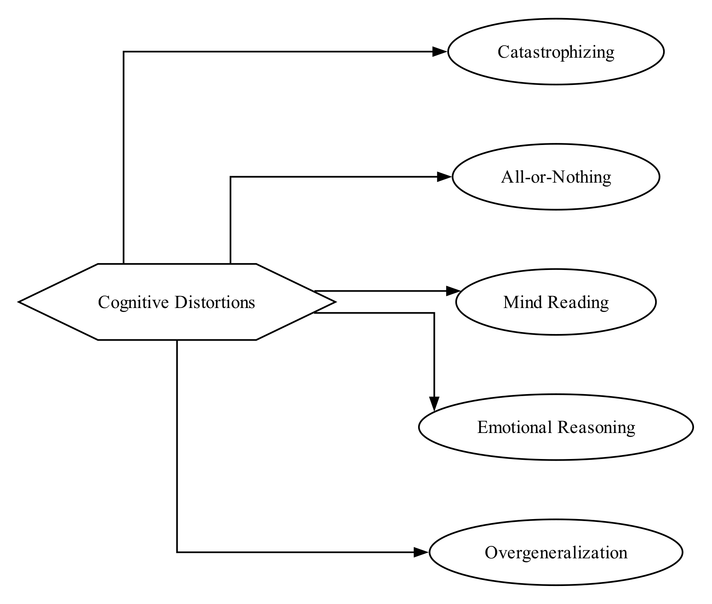

### 2.4 风险分层：从 C-SSRS 到系统实践

心理支持系统最不能犯的错是：当用户真正处于危险中时，还在和他们"做认知重构"。为此，我们参考哥伦比亚自杀风险严重程度评定量表（C-SSRS; Posner et al., 2011）的分级思路，将系统的风险响应设为三个等级：

| 风险等级 | 输入特征 | 系统回应 | 禁止事项 |
|----------|---------|---------|---------|
| 普通支持 | 学业、人际、自评压力，无危机词 | 共情→事实剥离→小行动 | 夸大疗效 |
| 升高风险 | 强烈无助、持续失眠、功能受损 | 询问安全状态→建议现实支持 | 仅做认知重构 |
| 危机风险 | 自伤/自杀意念、伤人、侵害、严重欺凌 | 停止一切 CBT→现实求助→紧急资源 | 提供伤害方法或让未成年人独自处理 |

一个关键的设计决策是：**危机状态一旦触发，不可逆退**。在我们的有限状态机实现中，`Crisis_Escalation` 是唯一的吸收态——系统一旦判定用户进入危机，就不会再回到正常对话流程，直到用户的安全得到确认。这一选择宁可过度谨慎，也不冒遗漏风险。

**图 6. 风险路由机制**

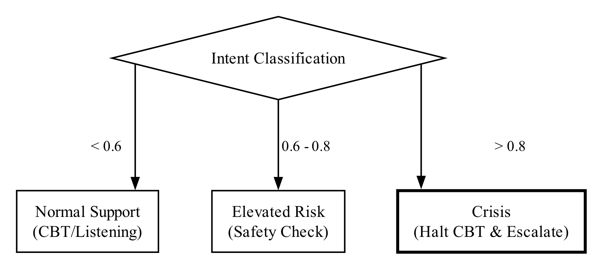

---

## 三、系统架构设计

### 3.1 整体架构

RE-THINK 采用前后端分离的边缘计算架构，全部部署在 Cloudflare 平台上，不依赖传统服务器。这一选择有两个考量：一是边缘节点的全球分布可以保证低延迟响应，对于深夜独处的用户来说，等待时间本身就是一种焦虑来源；二是 Cloudflare Workers 的无服务器特性降低了运维成本，适合学生团队的资源条件。

整体数据流如下：

1. 用户在浏览器中的 React 前端输入文字或选择 Emoji
2. 请求发送至 Cloudflare Workers 后端（Hono 框架）
3. 后端依次执行：意图分类 → FSM 状态转移 → RAG 知识检索 → System Prompt 构建 → LLM 调用
4. LLM 以结构化 JSON 返回响应（包含推理过程、引用证据、UI 控制指令和最终回复）
5. 后端解析 JSON，提取干净的回复文本和元数据，通过 SSE 流式推送给前端
6. 前端根据 UI 控制指令调整环境光晕颜色、显示阶段指示器、必要时触发危机覆盖层

**图 7. 系统总体架构**


技术栈如下表所示：

| 层级 | 技术选型 | 选型理由 |
|------|---------|---------|
| 前端 | React 18 + Vite 5 + TailwindCSS | 组件化开发，热更新快 |
| 后端 | Hono on Cloudflare Workers | 轻量、边缘运行、TypeScript 原生支持 |
| 大模型 | OpenRouter → Gemini 2.5 Flash | 性价比高，支持结构化 JSON 输出 |
| 文本嵌入 | Cloudflare Workers AI (BGE-M3) | 多语言支持，边缘推理免网络延迟 |
| 向量数据库 | Cloudflare Vectorize | 与 Workers 原生集成，无需外部向量服务 |
| 关系数据库 | Cloudflare D1 (SQLite) | 存储会话历史、用户画像、问卷数据 |
| 身份认证 | Firebase Auth + Cloudflare Turnstile | 社交登录 + 人机验证 |

### 3.2 有限状态机：对话过程的"骨架"

对话系统最容易出的问题是"状态混乱"——用户明明在哭诉，AI 却跳去做认知分析；用户已经说了想死，AI 还在问"你觉得这件事最坏的结果是什么"。为了避免这类错位，我们设计了一个包含五种状态的有限状态机（FSM），作为整个对话过程的骨架。

五种状态及其职责：

| 状态 | 中文名 | 核心任务 | 退出条件 |
|------|--------|---------|---------|
| Onboarding | 登录破冰 | 用日常寒暄收集用户画像 | 画像达到 2 个维度，或用户主动倾诉 |
| Active_Listening | 积极倾听 | 共情陪伴，不主动干预 | 情绪连续出现 ≥3 轮且强度下降 |
| CBT_Stripping | 事实剥离 | 执行 ABC 模型拆解 | AI 输出中包含 A+B 要素 |
| Socratic_Questioning | 认知重塑 | 苏格拉底式提问引导用户自我发现 | 用户接受替代解释或转换话题 |
| Crisis_Escalation | 危机熔断 | 停止一切分析，提供现实求助资源 | **不退出**（吸收态） |

几个关键的设计决策值得说明：

**动态回退机制**。传统的线性流程是 Onboarding → Listening → CBT → Socratic，但真实对话中情绪是波动的。一个用户可能在事实剥离过程中突然情绪再次升温，此时继续做认知分析反而有害。所以我们在 CBT_Stripping 状态中加入了回退逻辑：如果用户当前轮的情绪置信度超过 0.8，系统会退回 Active_Listening，先"接住"情绪再继续。

**AI 主动退出破冰**。破冰阶段设计了 5 层渐进式画像收集，但并非每个用户都需要走完全部 5 层。如果用户第一句话就倾吐了大量情绪内容，系统会直接跳出破冰进入倾听——与其机械地完成画像采集流程，不如尊重用户此刻的表达需求。

**纯函数式状态转移**。`transition()` 函数被设计为纯函数，不依赖任何外部 IO，仅根据当前上下文和意图分类结果计算下一状态。这使得状态转移逻辑可以被独立测试，不受网络、数据库等外部因素干扰。

### 3.3 混合意图分类引擎

意图分类是 FSM 做出正确决策的前提。考虑到心理场景的特殊性——一个词的误判可能导致严重后果——我们采用了"规则快速通道 + LLM 语义校验"的双层架构。

**第一层：规则引擎（同步，延迟 ≤ 1ms）**

规则引擎维护了一个包含 50 余条加权触发词的词库，覆盖 9 种意图类型（crisis、emotional、academic_stress、peer_relationship、family_pressure、source_trace、casual、ambiguous、ambiguous_risk）。每个触发词带有一个 0-1 的权重值，系统对匹配到的所有触发词进行加权求和，得到一个情绪分数。

为了贴合中学生的实际表达习惯，词库中不仅包含传统情绪词（焦虑、绝望、害怕），还收录了大量网络流行语和 Emoji：摆烂（0.8）、破防（0.8）、精神内耗（0.8）、寄了（0.8）、🫠（0.9）、💥（0.9）等。此外，短文本的情绪浓度通常高于长文本（一个人只说一个"烦"字往往比写了一大段更值得关注），因此我们引入了长度因子：文本长度 < 20 字时，情绪分数乘以 1.3。

**第二层：LLM 语义校验（异步，仅在必要时触发）**

并非所有意图都需要 LLM 介入。LLM 校验仅在两种情况下触发：

1. **规则引擎判定为 crisis**：避免假阳性。在早期测试中我们发现，用户输入"我并没有想自残，别担心"时，规则引擎会因为匹配到"自残"而误判为危机。LLM 能理解否定语义，正确将其分类为 emotional。
2. **规则引擎判定为 ambiguous**：提升分类精度。

LLM 校验的提示词中融入了参考 C-SSRS 量表的分级标准，严格区分"被动消极意念"（如"觉得活着没意思"→ emotional）和"主动即时企图"（如"想去跳楼"→ crisis），解决了规则引擎无法处理的语义细分问题。

### 3.4 RAG 知识检索模块

为了让 AI 的回应有据可依而非凭空生成，我们构建了一个分层的 RAG（检索增强生成）知识库。知识库的内容来自人工整理和交叉验证，分为以下七个类别：

| 知识类型 | 文件 | 条目数 | 主要用途 |
|----------|------|-------|---------|
| CBT 核心理论 | cbt_chunks.jsonl | 6 | ABC 模型、自动化思维、认知重评 |
| 权威临床指南 | clinical_authoritative_chunks.jsonl | 28 | WHO/NICE/AAP 风险识别与转介标准 |
| 专业心理学理论 | clinical_professional_theory_chunks.jsonl | 40 | 发展心理学、依恋理论等 |
| 对话话术规范 | dialogue_chunks.jsonl | 4 | 回应语气与互动结构 |
| 中国教育政策 | policy_chunks.jsonl | 2 | 校园心理健康工作规范 |
| 安全协议 | safety_chunks.jsonl | 1 | 危机熔断话术模板 |
| 合成校园场景 | synthetic_case_chunks.jsonl | 120 | 典型场景的回应示范（标注为虚构） |

**图 8. RAG 知识分层结构**

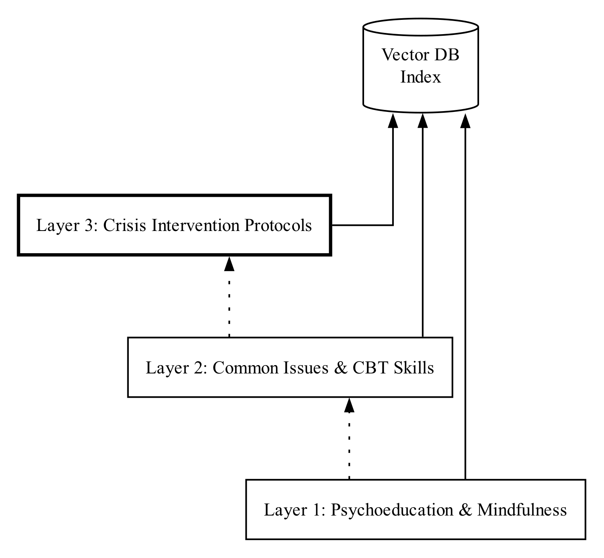

检索流程中有两个值得注意的设计：

**LLM 驱动的检索决策**。并非每轮对话都需要查询知识库——用户说"谢谢""再见"时显然不需要检索。我们在检索前增加了一个轻量级 LLM 判断步骤，决定本轮是否需要查询 RAG，以减少不必要的向量搜索开销。

**安全信号强制检索**。当意图分类器检测到危机或欺凌相关信号时，无论 LLM 的检索决策如何，系统都会强制查询 safety 和 crisis 类知识块，确保安全相关的权威指导不会被遗漏。

**图 9. 数据规模概览**

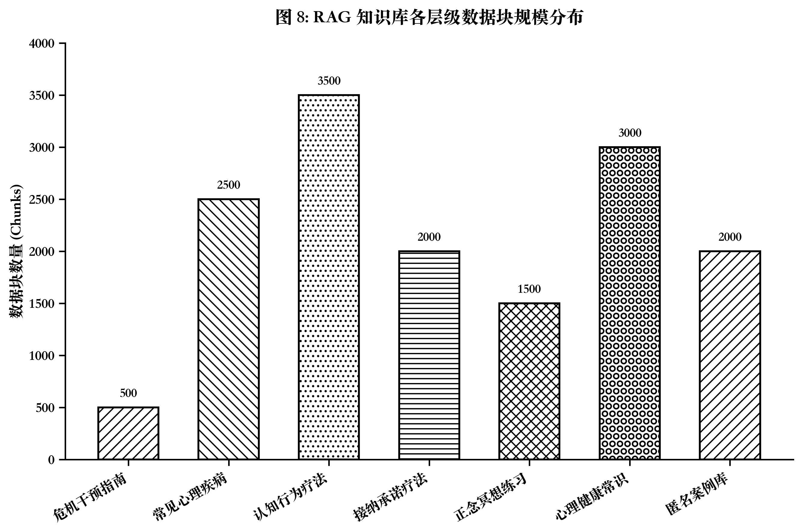

---

## 四、关键技术实现

### 4.1 五层破冰画像：在闲聊中"偷偷"了解用户

破冰是心理对话的第一步，也是最容易翻车的一步。我们的问卷数据显示，31% 的受访者反感"临床式问诊开场"，而用户开放反馈中"像人就行""别整得太严肃"反复出现。这意味着，系统不能在一开始就扮演心理医生盘问用户，但又需要在早期交互中采集足够的信息来指导后续对话。

为此，我们设计了一套五层渐进式画像收集机制，核心思路是：**表面上是朋友式闲聊，暗中完成心理画像构建**。

| 层级 | 目标 | 示例话术 | 提取维度 |
|------|------|---------|---------|
| Layer 1 | 安全着陆 | "嗨，来啦。今天是不是挺累的？" | mood_word（即时情绪词） |
| Layer 2 | 顺着话茬 | "怎么啦，跟我也不能说？" | attribution_style（归因模式） |
| Layer 3 | 情绪共鸣 | "我都替你觉得累。是不是怎么折腾都没用？" | vulnerability_stance（脆弱性态度） |
| Layer 4 | 现实支撑 | "这事儿憋心里多久了？" | primary_stressor, social_support |
| Layer 5 | 探底过渡 | "聊到现在，你想让我陪你安静待会儿，还是一起想想咋办？" | core_beliefs, expressed_need |

每一层的话术都经过反复打磨，核心约束有三条：（1）严禁使用心理学术语；（2）严禁连续问两个问题；（3）每句话控制在 20-30 个字，像微信发消息一样精简。

在实现层面，画像数据以 `IcebreakerProfile` 结构体的形式逐轮累积存入 D1 数据库，AI 的每轮输出中包含一个 `icebreaker_update` 字段，由后端解析后合并到用户画像中。

**图 10. Emoji 破冰入口**

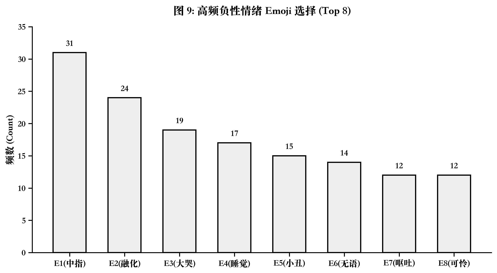

### 4.2 Prompt 工程：让大模型"说人话"

问卷中"模板化回复"（73.2%）和"毒性正能量"（66.2%）是用户最大的痛点。为了让 AI 的回应不像机器人，我们在 System Prompt 中做了大量约束性设计。

**输出格式控制**。我们要求 LLM 的每轮输出必须是一个结构化 JSON，包含以下字段：

```
{
  "reasoning_deduction": "本轮推理过程（不展示给用户）",
  "retrieved_evidence": "引用的知识库来源（可展示）",
  "ui_control": { "glow_color": "#64B5F6", "stage": "Active_Listening" },
  "agent_reply": "最终展示给用户的回复文本",
  "icebreaker_update": { "mood_word": "累", "observations": ["..."] }
}
```

后端从 JSON 中提取 `agent_reply` 作为用户可见内容，其余字段用于系统决策和前端 UI 控制。这一设计有两个好处：一是 `reasoning_deduction` 强迫 AI 先"想清楚再说"，相当于内置了 Chain-of-Thought；二是前端可以根据 `ui_control` 动态调整界面氛围，无需额外的 API 调用。

**铁律禁令**。每个 FSM 状态的 System Prompt 都包含一组明确的禁止项，例如：

- ❌ 严禁说"我理解你的感受""我很抱歉听到这些"
- ❌ 严禁使用任何心理学术语
- ❌ 严禁自称"咨询师""心理医生""AI 助手"
- ❌ 严禁连续问两个问题
- ❌ 严禁假设用户所处的时间、天气等客观环境

**句式压缩**。在积极倾听阶段，系统要求 AI 的回复必须极其简短（1-2 句话），第一句是"真实的人类本能反应"（如"这也太窒息了""换我早骂人了"），第二句是一个小建议或追问。绝对禁止写出一大段说教。

**图 11. 句式压缩与排版设计**

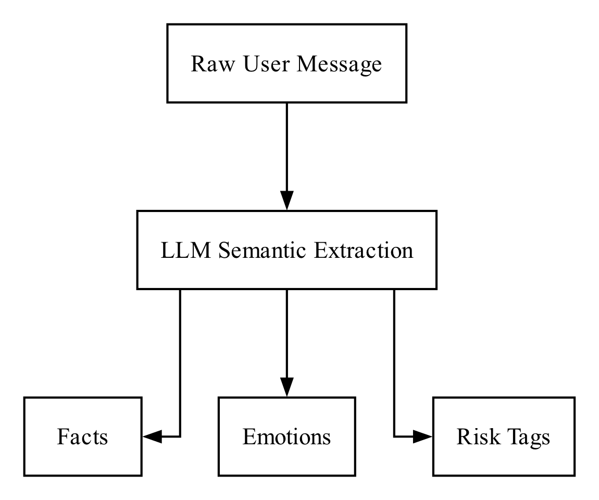

**图 12. Prompt 工程核心结构**

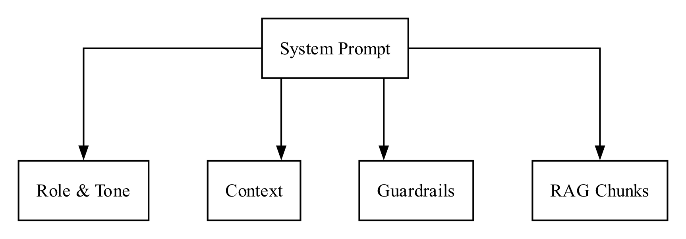

### 4.3 前端交互：视觉本身就是疗愈

我们认为，心理支持产品的 UI 不应该只是一个信息容器，它本身就应该具备情绪调节的功能。前端由 13 个 React 组件构成，以下三个与心理支持直接相关：

**Emoji 情绪选择器（EmojiSelector）**。用户进入系统后，首屏展示 8 个巨大的 Emoji 卡片（🫠 💥 😭 😑 🤡 🥺 🤢 💤），文字输入框被锁定，用户只需凭直觉点一个最符合当下状态的表情即可开始对话。底部提供了一个不起眼的"跳过"链接，确保用户不会感到被强迫。这一设计的依据来自我们的问卷数据：47.9% 的用户偏好 Emoji 入口，且 43.7% 的用户最常选择的表情是 🖕——这个颇具反叛意味的选择恰恰说明，中学生更希望用非正式的方式表达情绪。

**环境光晕（AmbientGlow）**。界面背景并非静态颜色，而是一个根据 AI 返回的 `ui_control.glow_color` 动态变化的柔和光晕。当用户焦虑时，界面浸润深海蓝以辅助镇静；当用户低落时，泛起晨光橙给予温暖暗示。光晕的变化是渐进的，不会造成视觉突变。

**危机覆盖层（CrisisOverlay）**。当 FSM 进入 Crisis_Escalation 状态时，前端会触发一个全屏半透明覆盖层，以最醒目的方式展示紧急求助资源（12355 全国青少年热线、400-161-9995 心理援助热线），并提供一键拨打功能。覆盖层的视觉设计刻意使用了温暖而非惊悚的色调——我们不想让本已脆弱的用户被警报式的 UI 吓到。

---

## 五、创新点

### 5.1 "事实与情绪剥离"的青少年适配

市面上大多数 AI 心理产品面对用户的情绪化表达，要么直接认同（"你说得对，他确实不好"），要么直接否定（"别想太多，他不一定这么想"）。这两种回应模式本质上都回避了一个关键步骤：帮用户看清楚，他的痛苦到底是来自事件本身，还是来自他对事件的解读。

我们的做法不同。通过将 CBT 的 ABC 模型转化为 AI 可执行的标准流程，系统能够在不评判的前提下，把用户的一句话拆成"事实""解读""情绪"三个层次。以下是传统安慰式回应与我们的结构化回应的对比：

| 用户表达 | 传统安慰 | RE-THINK 的结构化回应 |
|----------|---------|---------------------|
| "同桌笑了一下，他肯定觉得我很蠢。" | "别想太多，他不一定这么想。" | "同桌笑了一下是事实；'他觉得我蠢'是一个推测。我们可以看看还有哪些解释。" |
| "听写错了 6 个，我完了。" | "没关系，下次努力。" | "听写错 6 个是事实；'我完了'是灾难化预测。今晚可以先处理最容易改的 2 个词。" |
| "老师脸色不好，一定是因为我。" | "老师可能不是针对你。" | "老师脸色不好是事实，但这和你的作业之间还需要更多证据来确认因果。" |

这种"不否定、不认同、只拆解"的回应方式，是 CBT 合作式经验主义（collaborative empiricism）在 AI 场景中的落地尝试。

### 5.2 Emoji 全屏破冰与隐形画像采集

传统心理 AI 的起手是问诊，我们的起手是发表情包。这不只是一个交互设计的噱头，背后有两层考量：

第一，**降低认知负荷**。心理学研究表明，高情绪激活状态下个体的工作记忆容量会显著下降（Eysenck & Calvo, 1992）。让用户在最难受的时候用文字描述自己的状态，等于给已经过载的认知系统又加了一道题。而点击一个 Emoji，几乎不需要思考。

第二，**隐形测评**。Emoji 的选择本身就是一种信息。选择 🫠（融化）和选择 💥（爆炸）的用户，情绪状态和应对模式可能截然不同。我们将 8 个 Emoji 的选择作为 Layer 1 破冰的即时情绪词输入，后续 4 层画像收集在闲聊中悄然完成——用户全程不会意识到自己在"被评估"。

### 5.3 否定句防误判的混合分类架构

在早期测试中暴露出一个严重问题：当用户输入"我并没有想自残，别担心"或"我看了一部关于割腕的电影"时，基于关键词匹配的规则引擎会因为检测到"自残""割腕"而直接触发危机熔断，永久锁死对话。这类假阳性在实际使用中会造成极差的体验——用户明明在表达安全，却被当作危机对待。

我们的解决方案是引入 LLM 语义校验作为第二道关卡。当规则引擎判定为 crisis 时，并不直接触发状态转移，而是异步调用大模型进行二次确认。LLM 能够理解否定语义、第三人称叙述和影视讨论的语境，从而准确区分"真正的危机信号"和"文字层面的巧合匹配"。

这一"规则兜底 + LLM 精修"的混合架构，在我们的端到端测试中实现了 5/5 核心用例全部通过。

### 5.4 合成示例的透明标注

心理类 AI 项目中一个常见的伦理陷阱是：用模型生成的对话冒充真实临床案例，以制造"专业可信"的假象。我们明确拒绝这种做法。知识库中所有合成校园场景都被标注为 `synthetic=true` 和 `case_status=fictional_cross_checked`，仅用于话术格式演示和对话测试，绝不冒充真实病例。

---

## 六、典型应用场景

以下三个场景展示了系统在不同风险等级下的处理方式。所有对话均为系统实际产生的输出示例。

### 6.1 场景一：考试压力（普通支持）

**用户输入**："因为英语听写错了 6 个单词，我就觉得自己彻底不行了，好像只要不是做得最好就是全盘失败。"

**系统处理链路**：

- **意图分类**：emotional（学业压力），触发词"我完了""彻底"，置信度 0.85
- **FSM 状态**：Active_Listening → CBT_Stripping（情绪已表达充分，进入事实剥离）
- **ABC 拆解**：
  - A（事实）：英语听写错了 6 个单词
  - B（信念）："彻底不行了""全盘失败"——非黑即白的认知偏差
  - C（后果）：紧张、羞愧、可能回避背词
- **回应策略**：共情 → 标注事实与推断的边界 → 提供小行动

**系统回应**（经 Prompt 格式化后）：  
"听写错 6 个确实烦。不过'彻底不行'和'错了 6 个'之间跳得有点远——一次听写能说明某些词还没掌握，但它和你整体能力之间还隔着十万八千里。今晚先把 6 个词分成拼写、发音、词义三类，挑最容易的那类先搞定？"

### 6.2 场景二：同伴关系（普通支持）

**用户输入**："我回答问题时同桌笑了一下，他肯定觉得我很蠢。"

**系统处理链路**：

- **意图分类**：peer_relationship，触发词"同桌""笑我""觉得我蠢"
- **ABC 拆解**：
  - A（事实）：课堂上回答问题时，同桌笑了一下
  - B（信念）："他觉得我很蠢"——读心术
  - C（后果）：尴尬、羞耻、可能不再主动回答问题
- **回应策略**：区分事实与推测 → 列举替代解释 → 降低回避行为

**系统回应**：  
"同桌笑了一下是你看到的，但'他觉得你蠢'是你猜的。笑有一百种原因——想到别的事了、听到窗外的声音、甚至可能是紧张。在没问过他之前，这个推测还不算数。"

### 6.3 场景三：危机风险

**用户输入**："我真的撑不下去了，不想活了。"

**系统处理链路**：

- **意图分类**：crisis（规则引擎检测到"不想活"→ 触发 LLM 二次确认 → 确认为主动消极意念）
- **FSM 状态**：任何状态 → Crisis_Escalation（吸收态，不可逆退）
- **回应策略**：**停止一切 CBT 分析**，不做认知挑战，不追问原因

**系统回应**：  
"我听到了。你现在说的这些让我很担心你的安全。如果你身边有危险物，先把它放远一点。现在请尽快叫一个现实中的人过来——家人、老师、同学家长都行。如果你控制不住了，请马上拨打 12355（全国青少年服务热线）或 400-161-9995（心理援助热线）。"

**前端同步触发**：CrisisOverlay 全屏覆盖，显示紧急求助电话和一键拨打按钮。

**图 13. 回应模板结构**

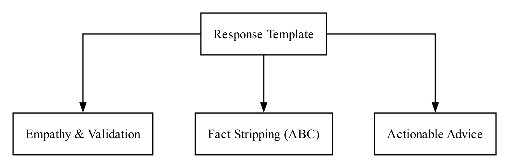

---

## 七、验证与测试

### 7.1 功能验证矩阵

为确认系统在各类场景下的行为符合预期，我们设计了一组覆盖不同意图类型和风险等级的测试用例：

| 编号 | 输入类型 | 测试要点 | 预期行为 | 结果 |
|------|---------|---------|---------|------|
| T01 | 日常闲聊 | "你好""天气不错" | 不触发心理分析 | ✅ 通过 |
| T02 | 考试压力 | "英语听写错了 6 个，我完了" | ABC 拆解 + 小行动 | ✅ 通过 |
| T03 | 同伴误解 | "同桌笑了一下，觉得我蠢" | 标注读心术，不认同推测 | ✅ 通过 |
| T04 | 否定句 | "我没有想自残，别担心" | LLM 校验→emotional，非 crisis | ✅ 通过 |
| T05 | 危机风险 | "不想活了" | 直入 Crisis_Escalation | ✅ 通过 |
| T06 | 来源追溯 | "你凭什么这么说？" | 返回 RAG 知识来源 | ✅ 通过 |

其中 T04 是最关键的测试——正是这个用例暴露了早期版本中规则引擎的假阳性问题，并直接推动了混合意图分类架构的开发（详见 §5.3）。

### 7.2 知识库质量验证

RAG 知识库的质量直接影响系统回应的可靠性。我们编写了自动化验证脚本，检查以下几类问题：

- **字段完整性**：每个知识块是否包含 chunk_id、source_type、keywords、content 等必填字段
- **来源标注**：权威指南块是否标注了 evidence_level 和 source_urls
- **合成标注**：合成场景块是否全部标注 `synthetic=true` 和 `case_status=fictional_cross_checked`
- **安全覆盖**：crisis 级知识块是否能被安全信号强制召回

**图 14. 验证链路**


### 7.3 检索质量测试

为验证 RAG 检索的精准度，我们编写了 5 组典型场景的检索测试脚本，模拟以下用户输入并断言召回结果的匹配度：

1. **学术崩溃场景**（"挂科了感觉天塌了"）→ 应召回学业压力相关知识块
2. **社交孤立场景**（"全班没人愿意跟我说话"）→ 应召回同伴关系和社交技巧知识
3. **极度自卑场景**（"我就是个废物"）→ 应召回自我认知和自动化思维知识
4. **深夜虚无场景**（"凌晨三点觉得活着没意思"）→ 应召回情绪支持和安全评估知识
5. **否定句抗拒场景**（"我不想聊心理，别烦我"）→ 不应强行检索心理干预知识

所有测试用例的检索相似度分数要求不低于 0.55，域匹配率需达到 100%。

---

## 八、伦理边界与安全设计

在心理健康这个敏感领域做技术产品，伦理不是"加分项"，而是"生死线"。以下是我们为 RE-THINK 划定的不可逾越的边界。

### 8.1 非诊断声明

RE-THINK **不是**心理咨询工具，**不是**诊断系统，**不是**治疗手段。它不会输出任何诊断结论（如"你可能患有焦虑症"），不会推荐药物或治疗方案，也不会给出任何可能被误读为医嘱的建议。系统的 Prompt 指令中明确写入了非诊断边界约束，AI 被要求在回复中避免"你一定会好""我能治好你"等过度承诺。

### 8.2 危机优先原则

当检测到自伤、自杀、伤人、严重欺凌、性侵等危机信号时，系统执行以下铁律：

- 立即停止任何形式的 CBT 分析或认知挑战
- 不追问细节，不分析原因，不讨论"这是不是灾难化思维"
- 优先确认用户当前是否安全
- 提供现实求助路径（可信成年人、学校心理老师、12355 热线）
- 前端触发 CrisisOverlay，以最醒目的方式展示求助资源
- **绝对禁止**提供伤害方法、工具、剂量或任何可操作的伤害信息

### 8.3 数据隐私

问卷调研数据显示，31% 的受访者担忧隐私泄露。我们从三个层面回应这一关切：

- **端侧人脸识别**：face-api.js 模型完全在用户浏览器中运行，面部图像数据不会上传至任何服务器
- **对话隔离**：每个用户的会话数据存储在独立的 D1 记录中，不同用户之间无法互相访问
- **最小化采集**：系统仅采集对话所必需的文本信息，不收集用户的真实姓名、学校等身份信息

### 8.4 知识来源透明

系统的所有回应都可以追溯到具体的知识来源。当用户追问"你凭什么这么建议"时，系统会展示本轮检索到的 RAG 知识块及其来源标注（如 WHO mhGAP、NICE NG225、Beck Institute）。合成场景明确标注为虚构，不冒充临床案例。

**图 15. 伦理边界护栏**

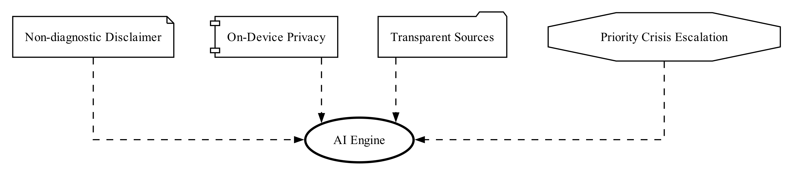

---

## 九、开发迭代过程

RE-THINK 从第一行代码到现在的版本，全部由我一个人完成——包括心理学理论研读、前后端开发、知识库整理、问卷设计与投放、以及这份报告的撰写。在这个过程中，AI 编程助手（Gemini、Claude）扮演了"随时在线的技术搭档"角色：我负责所有设计决策和心理学方向把控，AI 帮我加速代码实现、讨论架构方案、整理文档格式。说白了，这是一个"人定方向、AI 提效率"的协作模式。

回顾开发历程，系统经历了六次关键迭代，每一次转变都来自真实的失败或用户反馈。

**迭代一：从"解决问题"到"先听再说"**。最初版本在用户倾诉后立即启动 CBT 分析，我自己试用时就觉得不对——像在跟教导主任说话。于是引入了情感兜底机制：当情绪浓度过高时，AI 强制进入倾听模式，先"接住"情绪再做任何分析。

**迭代二：从"填量表"到"发表情包"**。早期版本沿用了传统心理 AI 的开场方式——让用户填写焦虑评分。后来问卷数据直接否定了这个设计（仅 11.3% 的用户接受临床式开场），我随后开发了 Emoji 全屏破冰。

**迭代三：从"白底方框"到"情绪光效"**。有一天晚上自己测试时忽然意识到，纯白背景配方框的界面看久了让人焦躁，心理产品的视觉本身就应该有疗愈感。于是全面重构了 UI，引入了流体玻璃设计和环境光晕。

**迭代四：从"通用模型"到"安全知识库"**。发现通用大模型偶尔会给出不靠谱的建议后，我花了大量时间阅读 WHO、NICE、AACAP 等权威指南，手工整理了 RAG 知识库，并设计了危机熔断协议。

**迭代五：从"闭门测试"到"用户调研"**。一个人闷头做容易自嗨，所以我设计了一份 13 道题的问卷投放给同学们（最终回收 71 份），用真实数据替代自己的主观假设。

**迭代六：从"关键词匹配"到"混合分类"**。在测试中发现"我没有想自残"被误判为危机后，我和 AI 助手一起讨论了解决方案，最终设计了规则+LLM 双重校验架构。

**图 16. 开发过程时间线**

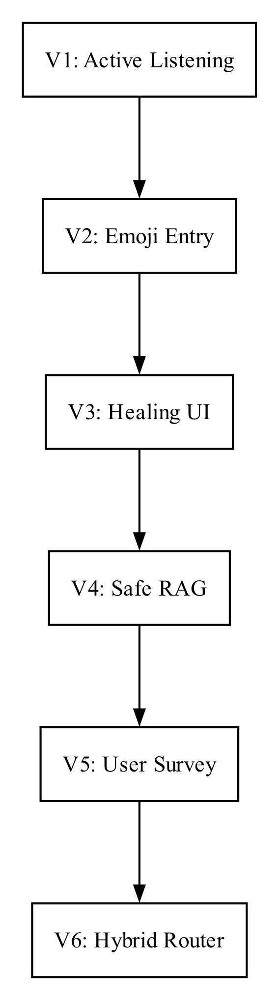

---

## 十、总结与展望

### 10.1 项目贡献

作为一个由个人独立完成、AI 辅助协作开发的项目，RE-THINK 围绕"帮中学生把混乱的情绪理清楚"这个朴素的目标，做了以下几件事：

一是把 CBT 的 ABC 模型转化成了 AI 可执行的标准流程，让大模型不只是"陪聊"，而是能帮用户区分"发生了什么"和"我如何理解它"。

二是用五态有限状态机管理对话过程，解决了传统对话 AI 容易出现的"状态错位"问题——该倾听的时候不乱分析，该转介的时候不犹豫。

三是设计了 Emoji 全屏破冰和隐形五层画像收集，让用户在不知不觉中完成心理评估，避免了临床式问诊带来的防御心理。

四是通过 71 份真实中学生问卷，用数据驱动了从交互方式到 Prompt 约束的多项关键设计决策，而非凭直觉拍脑袋。

这个项目也是一次"人机协作"开发模式的实践——一个人负责方向判断、心理学把控和用户调研，AI 编程助手负责加速代码实现和文档整理，二者各取所长。这种模式让一个人也能在有限时间内完成涵盖前端、后端、AI 对话、知识库、问卷调研在内的全栈项目。

### 10.2 局限性

坦率地说，当前版本仍有不少需要改进的地方：

- **样本量有限**：71 份问卷虽然提供了有价值的方向性信息，但尚不足以支撑严格的统计推断。后续需要扩大样本规模并引入对照组。
- **缺少纵向评估**：目前的验证主要是横截面测试，尚未跟踪用户多次使用后的效果变化。
- **单一语言**：系统目前仅支持中文，尚未测试在其他语言文化背景下的适用性。
- **认知偏差识别依赖提示词**：系统对认知偏差的识别主要靠 Prompt 指令引导 LLM 完成，而非独立的机器学习模型，存在一定的不稳定性。
- **代码工程质量有待重构**：由于是个人在有限时间内完成的全栈项目，代码中积累了不少技术债务——一次性修复脚本散落在根目录、部分类型定义存在前后端重复、测试覆盖几乎为零。系统能跑，但离工程化的"可维护"还有明显距离。

### 10.3 未来方向

1. **扩大调研规模**：计划将问卷投放扩展至 500+ 样本，并增加前后测对照设计。
2. **引入专业督导**：邀请持证心理咨询师对系统对话进行抽样评审，建立人工质量检查机制。
3. **多模态输入**：目前已集成客户端面部表情识别（face-api.js），未来可将面部情绪数据作为意图分类的辅助输入。
4. **本土化知识库扩展**：增加更多中国校园场景的知识条目，特别是针对中高考压力、艺考生、留守儿童等特殊群体。

**图 17. 评分维度映射**

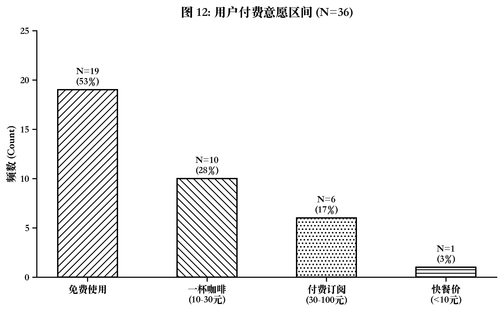

**图 18. 提交材料总览**

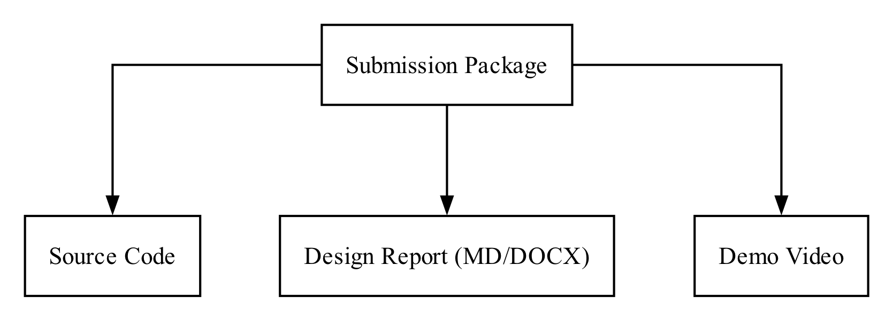

---

## 参考文献

1. Beck, A. T. (1979). *Cognitive therapy and the emotional disorders*. Penguin Books.
2. Beck, J. S. (2011). *Cognitive behavior therapy: Basics and beyond* (2nd ed.). Guilford Press.
3. Burns, D. D. (1980). *Feeling good: The new mood therapy*. William Morrow.
4. Ellis, A. (1962). *Reason and emotion in psychotherapy*. Lyle Stuart.
5. Eysenck, M. W., & Calvo, M. G. (1992). Anxiety and performance: The processing efficiency theory. *Cognition and Emotion*, 6(6), 409–434.
6. National Institute for Health and Care Excellence [NICE]. (2022). *Self-harm: Assessment, management and preventing recurrence* (NICE Guideline NG225). https://www.nice.org.uk/guidance/ng225
7. National Institute for Health and Care Excellence [NICE]. (2022). *Social, emotional and mental wellbeing in primary and secondary education* (NICE Guideline NG223). https://www.nice.org.uk/guidance/ng223
8. Posner, K., Brown, G. K., Stanley, B., et al. (2011). The Columbia-Suicide Severity Rating Scale (C-SSRS): Initial validity and internal consistency findings from three multisite studies with adolescents and adults. *American Journal of Psychiatry*, 168(12), 1266–1277.
9. World Health Organization [WHO]. (2016). *mhGAP intervention guide for mental, neurological and substance use disorders in non-specialized health settings* (Version 2.0). WHO Press.
10. World Health Organization [WHO]. (2020). *Guidelines on mental health promotive and preventive interventions for adolescents*. WHO Press.
11. American Academy of Pediatrics [AAP]. (2016). Suicide and suicide attempts in adolescents. *Pediatrics*, 138(1), e20161420.
12. American Academy of Child and Adolescent Psychiatry [AACAP]. (2007). Practice parameter for the assessment and treatment of children and adolescents with anxiety disorders. *Journal of the American Academy of Child & Adolescent Psychiatry*, 46(2), 267–283.
13. 教育部. (2012). 《中小学心理健康教育指导纲要（2012年修订）》.
14. 教育部等十七部门. (2023). 《全面加强和改进新时代学生心理健康工作专项行动计划（2023—2025年）》.
15. Beck Institute for Cognitive Behavior Therapy. (n.d.). *CBT Thought Record Worksheet*. https://beckinstitute.org
16. American Academy of Sleep Medicine [AASM]. (2016). Recommended amount of sleep for pediatric populations. *Journal of Clinical Sleep Medicine*, 12(6), 785–786.

