# 青少年心理支持智能体作品设计报告（草案）

项目名称：青少年心理支持智能体：基于 CBT 事实剥离与 RAG 安全边界的个性化心理支持原型  
参赛方向：智能体应用方向  
适用对象：初中生、高中生及校园心理健康教育场景  
版本：V0.1 草案  

## 摘要

本项目面向青少年在学业压力、同伴关系、自我评价、亲子沟通等高频心理场景中的情绪支持需求，设计一套基于主流人工智能大模型的心理主题智能体原型。系统以自然语言处理为入口，识别用户倾诉中的事实、信念、情绪、行为倾向与风险信号；以 CBT 认知行为疗法中的 ABC 模型和自动化思维记录为核心解释框架，帮助用户区分“客观发生的事件”和“脑中出现的解释”；以权威指南与政策资料构建 RAG 知识库，确保系统在危机、升高风险、普通支持等不同场景中执行分层回应；以多模态材料展示系统流程、对话样例、测试页面和过程性证明，形成可落地、可验证的应用方案。

本项目不进行心理诊断，不替代心理咨询、精神科评估、医学检查或危机急救。其定位是面向青少年的心理教育、情绪支持、结构化整理、自助练习与现实求助路径建议。

**Figure 1. 项目一句话定位图**

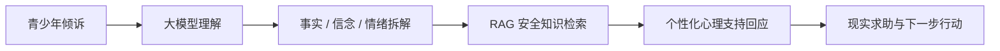

## 一、项目背景

### 1.1 青少年心理健康需求

青少年阶段处于自我概念发展、学业竞争增强、人际归属需求上升和家庭关系重塑的交汇期。许多心理困扰并不一定以正式疾病形式出现，而是表现为“考试没考好就觉得自己很差”“朋友没有回复就认为对方讨厌自己”“一次被老师批评就担心以后没有希望”等日常化、情境化表达。这类表达具有三个特点：

- 事件具体：通常由考试、同伴互动、教师评价、家长比较等场景触发。
- 情绪强烈：焦虑、羞愧、沮丧、愤怒、孤独等情绪可能迅速升高。
- 推断混杂：事实、评价、他人动机推测和未来灾难化预测常被混在同一句话中。

传统心理健康教育资源在学校中具有重要价值，但青少年在真实困扰出现时，常面临“不知道如何表达”“害怕被评价”“不想马上告诉成年人”“只想先有人听一听”等低门槛支持需求。因此，一个安全、温和、结构化、非诊断的心理支持智能体，可以作为校园心理健康教育和现实求助体系之间的辅助入口。

**Figure 2. 青少年心理困扰的常见触发场景**

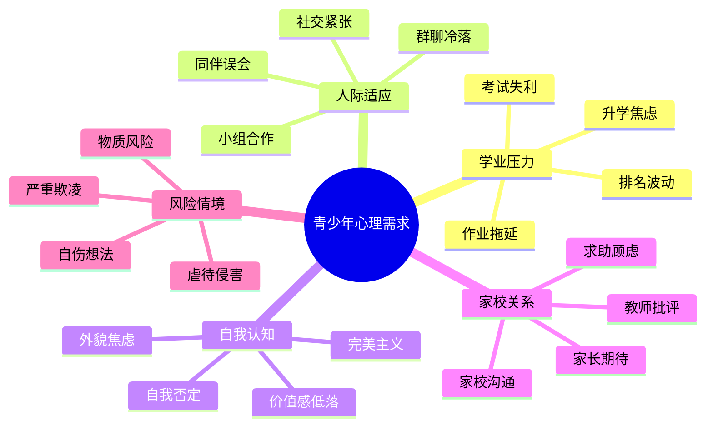

### 1.2 技术背景

主流人工智能大模型具备自然语言理解、多轮对话、信息整合和文本生成能力，适合承担“倾听、澄清、结构化整理、生成建议”的辅助任务。但心理主题应用必须解决安全性、可解释性、证据来源和未成年人保护边界问题。本项目将大模型能力限制在心理教育和支持范围内，通过规则、RAG 知识库和风险路由机制降低误导性输出。

**Figure 3. 大模型心理支持应用的机会与风险**

| 维度 | 机会 | 风险 | 本项目应对方式 |
|---|---|---|---|
| 自然语言理解 | 低门槛接收倾诉 | 误把推测当事实 | ABC 事实剥离 |
| 情感识别 | 快速识别情绪强度 | 夸大或误判风险 | 风险分层与澄清问题 |
| 生成式回应 | 个性化表达支持 | 过度承诺效果 | 非诊断声明与边界规则 |
| 知识调用 | 接入权威资料 | 来源不可追溯 | RAG 来源索引与字段规范 |
| 多轮互动 | 陪伴式支持 | 替代现实求助 | 危机优先转介 |

## 二、项目目的

本项目目标是设计并验证一个面向青少年心理成长场景的智能体原型，使其能够在非诊断边界内完成以下任务：

1. 识别青少年倾诉中的客观事实、主观解释、情绪与行为倾向。
2. 根据 CBT ABC 模型帮助用户区分“发生了什么”和“我如何理解它”。
3. 识别常见认知偏差，如非黑即白、读心术、灾难化、过度概括、个人化等。
4. 根据风险等级调用不同响应策略，普通压力场景提供情绪支持和小行动建议，危机场景优先给出现实求助路径。
5. 通过 RAG 知识库引入权威指南、政策资料和 CBT 理论，提升输出的可解释性和可追溯性。
6. 通过测试页面、样例对话、流程截图和成果介绍视频形成可验证参赛材料。

**Figure 4. 项目目标闭环**

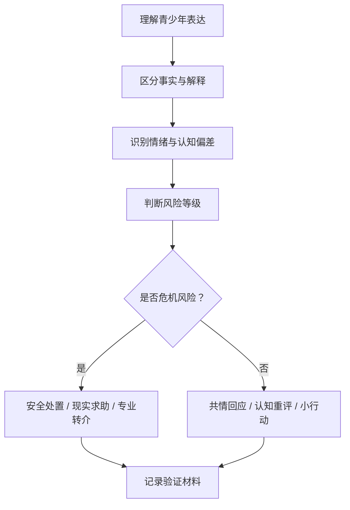

## 三、作品功能设计

### 3.1 总体功能

本智能体由五类核心功能组成：倾诉理解、事实剥离、情绪与偏差识别、RAG 安全检索、个性化回应生成。

**Figure 5. 核心功能模块图**

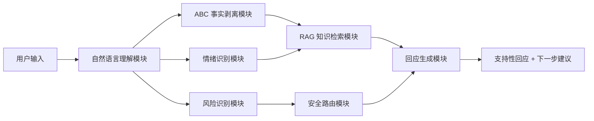

### 3.2 自然语言处理模块

自然语言处理模块负责从用户输入中抽取可观察事实、评价性表达、绝对化词汇、他人心理推断、未来预测和风险信号。系统优先扫描以下线索：

- 情绪词：焦虑、难过、羞愧、生气、害怕、孤独、崩溃。
- 自我标签：我很差、我没用、我是废物、我不配。
- 绝对化表达：总是、从来、肯定、一定、彻底、没有人。
- 他人推断：他讨厌我、老师看不起我、同学故意针对我。
- 未来灾难：我完了、以后都不会好、中考肯定失败。
- 危机信号：不想活、想死、自伤、伤害别人、被严重欺负、被侵害。

**Figure 6. 用户输入解析示意图**

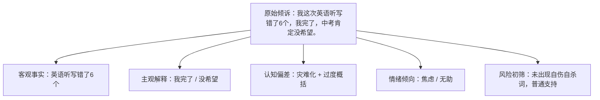

### 3.3 CBT 事实与情绪剥离模块

本项目采用 CBT 中的 ABC 模型作为核心结构。A 是诱发事件，必须符合“监控摄像头标准”，即只包含可以被第三方观察、记录或复核的信息；B 是信念解释，包含用户对事件的评价、推测、意义建构和认知偏差；C 是情绪与行为结果，包含情绪名称、身体反应和行为倾向。

**Figure 7. ABC 模型在本项目中的定义**

| ABC 要素 | 项目定义 | 可进入内容 | 不可进入内容 |
|---|---|---|---|
| A 诱发事件 | 可观察事实 | 时间、地点、人物、动作、原话、分数 | 丢脸、针对我、看不起我、完了 |
| B 信念解释 | 对事实的解释 | 我没用、他讨厌我、我肯定失败 | 纯物理动作本身 |
| C 情绪行为 | 由解释引发的结果 | 焦虑、羞愧、哭泣、回避、争吵 | 他人的真实动机 |

**Figure 8. “监控摄像头标准”判定流程**

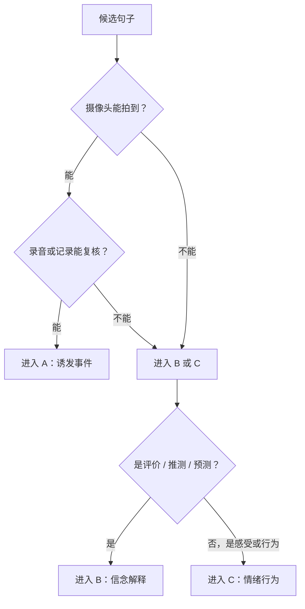

### 3.4 认知偏差识别模块

系统针对青少年场景预置常见认知偏差识别规则，用于把“看似事实的主观解释”标注为 B，而不是直接认同其真实性。

**Figure 9. 青少年高发认知偏差矩阵**

| 认知偏差 | 典型表达 | 校园场景 | 智能体处理 |
|---|---|---|---|
| 非黑即白 | 没做到最好就是失败 | 考试、竞赛、展示 | 保留中间状态和局部改进空间 |
| 读心术 | 他肯定讨厌我 | 同伴未回复、课堂发笑 | 区分事实与动机推测 |
| 灾难化 | 我以后完了 | 升学、排名下降 | 降低确定性预测，寻找可控步骤 |
| 过度概括 | 大家以后都不会理我 | 一次展示失误 | 限定事件范围，避免长期化 |
| 个人化 | 老师脸色不好一定因为我 | 教师反馈、班级氛围 | 检查证据，寻找其他解释 |

### 3.5 情感计算与风险分层模块

情感计算模块用于识别用户情绪类别、强度和风险等级。系统不将情绪识别等同于诊断，而是把它作为回应强度、提问方式和转介建议的依据。

**Figure 10. 情绪强度与回应策略图**

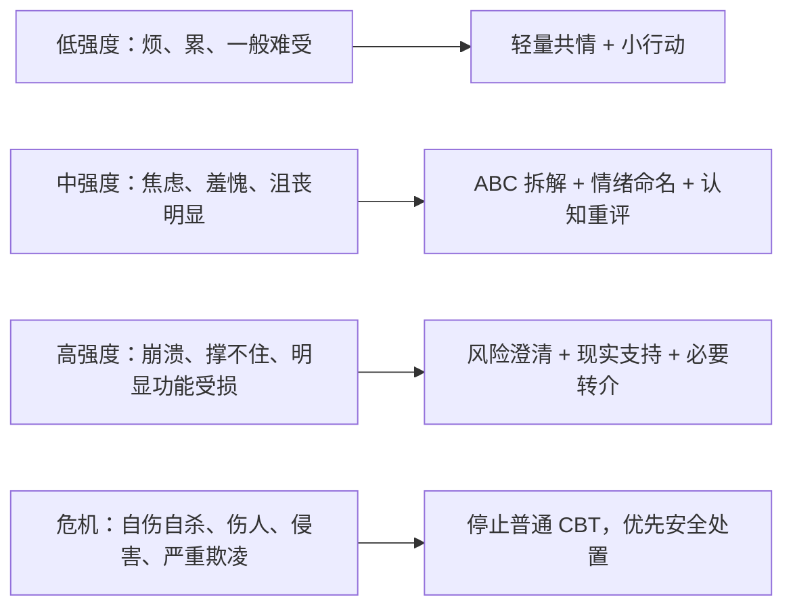

**Figure 11. 风险分层表**

| 风险等级 | 输入特征 | 系统回应重点 | 禁止事项 |
|---|---|---|---|
| 普通支持 | 学业、人际、自我评价压力，无危机词 | 共情、事实剥离、小行动 | 夸大疗效 |
| 升高风险 | 强烈无助、持续失眠、明显功能受损 | 询问安全、建议现实支持 | 只做认知重构 |
| 危机风险 | 自伤、自杀、伤人、侵害、严重欺凌 | 联系可信成年人、专业人员、紧急资源 | 提供伤害方法或让未成年人独自处理 |

### 3.6 RAG 知识库模块

项目已整理 RAG 知识库，包括 CBT 理论块、临床权威指南块、专业理论块、政策块、对话话术块和合成场景块。知识库严格区分“权威指南”“学派理论”“政策文件”“合成示例”，不把模型生成内容称为真实临床案例。

**Figure 12. 当前知识库文件构成**

| 文件 | 行数 | 主要用途 |
|---|---:|---|
| `clinical_authoritative_chunks.jsonl` | 28 | 权威指南与安全边界 |
| `clinical_professional_theory_chunks.jsonl` | 40 | 专业心理理论支撑 |
| `synthetic_case_chunks.jsonl` | 120 | 校园合成场景与话术演示 |
| `cbt_chunks.jsonl` | 6 | CBT 核心理论和事实剥离 |
| `dialogue_chunks.jsonl` | 4 | 对话风格和互动结构 |
| `policy_chunks.jsonl` | 2 | 中国校园心理健康政策 |
| `clinical_authoritative_sources.md` | 81 | 权威来源索引 |
| `rag_quality_rules.md` | 41 | RAG 入库和召回规则 |

**Figure 13. RAG 知识来源分层图**

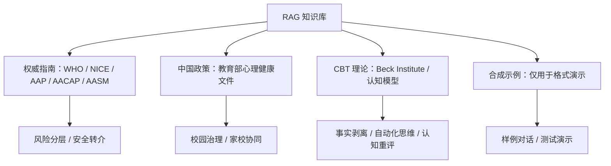

**Figure 14. 知识块字段规范**

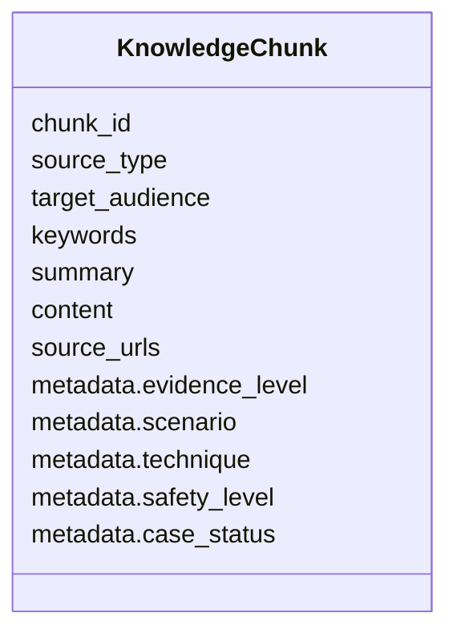

### 3.7 个性化回应生成模块

系统根据用户场景、情绪强度、认知偏差和风险等级生成个性化回应。回应遵循“先接住情绪，再拆分事实，后给出小行动”的顺序。

**Figure 15. 个性化回应生成流程**

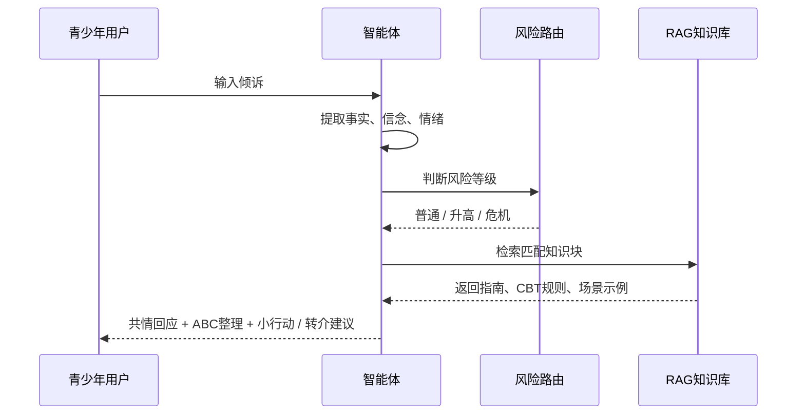

**Figure 16. 回应模板结构**

| 步骤 | 输出内容 | 示例 |
|---|---|---|
| 1 | 情绪接纳 | “这件事让你很难受，是可以理解的。” |
| 2 | 事实剥离 | “能确认的是：这次英语听写错了 6 个。” |
| 3 | 信念标注 | “脑中出现的判断是：‘我完了’。” |
| 4 | 认知偏差提醒 | “这可能有一点灾难化，把一次听写推到了中考结果。” |
| 5 | 平衡解释 | “一次听写能说明某些词还没掌握，但不能直接决定整体能力。” |
| 6 | 小行动 | “今晚先把 6 个词分成拼写、发音、词义三类。” |

## 四、系统原型与交互设计

### 4.1 原型组成

当前项目已包含一个面向高中生心理疏导智能体的首次聊天破冰开场低注意力反应测试页面 `survey.html`。该页面用于测试不同开场话术是否能降低用户防备、提升继续对话意愿，为后续智能体正式对话设计提供依据。

**Figure 17. 原型资产清单**

| 原型资产 | 路径 | 作用 |
|---|---|---|
| 首次聊天测试页面 | `survey.html` | 测试破冰开场话术 |
| CBT 核心规则 | `cbt_core_rules.md` | 约束智能体事实剥离与安全边界 |
| RAG 质量规则 | `data/cleaned/rag_quality_rules.md` | 约束知识库来源和召回优先级 |
| 权威来源索引 | `data/cleaned/clinical_authoritative_sources.md` | 支撑报告引用与来源核验 |
| 合成场景数据 | `data/cleaned/synthetic_case_chunks.jsonl` | 展示青少年常见场景回应 |

### 4.2 用户旅程

**Figure 18. 青少年用户使用旅程图**

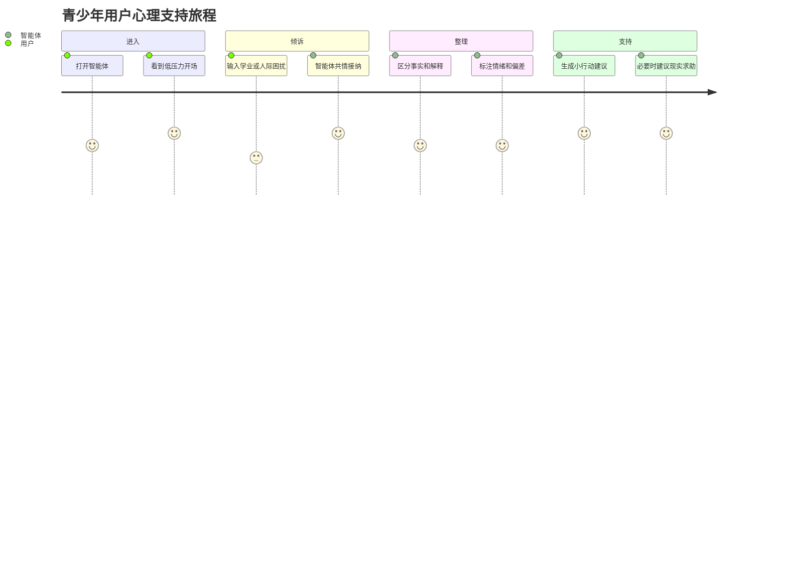

### 4.3 首次聊天破冰测试

首次聊天破冰测试关注“用户是否愿意继续聊”。测试页面通过不同风格的开场卡片，收集用户对继续、跳过、退出等反应的选择，为正式智能体的第一句话设计提供依据。

**Figure 19. 首次聊天测试页面流程**

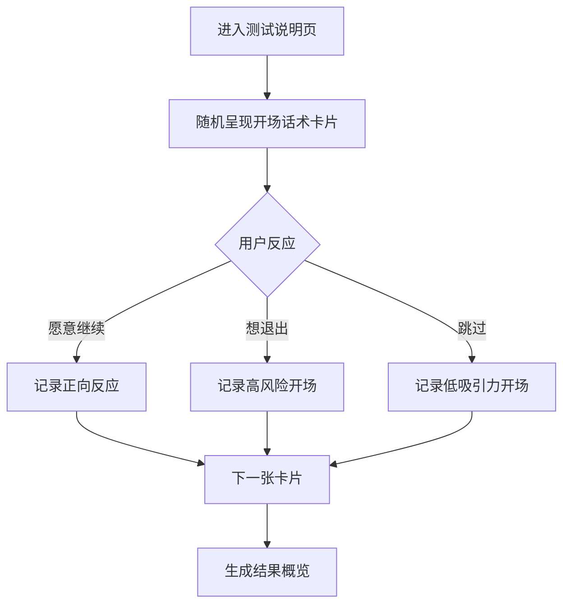

**Figure 20. 测试页面截图占位**

> 此处插入 `survey.html` 首页截图。  
> 建议文件名：`figures/figure20_survey_intro.png`。  
> 图注：首次聊天破冰测试首页，用于说明测试目的、测试方式和用户进入路径。

**Figure 21. 开场话术卡片截图占位**

> 此处插入开场话术测试卡片截图。  
> 建议文件名：`figures/figure21_opening_card.png`。  
> 图注：系统随机呈现不同开场话术，观察用户对继续聊天的意愿。

**Figure 22. 结果概览截图占位**

> 此处插入测试结果页面截图。  
> 建议文件名：`figures/figure22_survey_result.png`。  
> 图注：测试完成后展示不同类别开场话术的继续率、退出率和优化方向。

## 五、创新点

### 5.1 “事实与情绪剥离”的青少年适配

项目把 CBT 中的 ABC 模型转化为适合大模型执行的标准作业流程，强调 A 必须符合“监控摄像头标准”。这使智能体不会直接认同“老师看不起我”“大家讨厌我”“我完了”等情绪化推断，而是先帮助用户看到可确认事实。

**Figure 23. 传统安慰与本项目回应差异**

| 用户表达 | 普通安慰式回应 | 本项目结构化回应 |
|---|---|---|
| “同桌笑了一下，他肯定觉得我很蠢。” | “别想太多，他不一定这么想。” | “能确认的是同桌笑了一下；‘他觉得我蠢’是一个推测。我们可以看看还有哪些解释。” |
| “听写错了 6 个，我完了。” | “没关系，下次努力。” | “听写错 6 个是事实；‘我完了’是灾难化预测。今晚可以先处理最容易改的 2 个词。” |
| “老师脸色不好，一定是因为我。” | “老师可能不是针对你。” | “老师脸色不好和你作业晚交都是事实，但二者因果还需要证据。” |

### 5.2 安全优先的 RAG 路由

项目规定 `safety_level=crisis` 的知识块必须覆盖普通 CBT、共情和话术模板。当出现自伤、自杀、伤人、虐待、性侵、严重欺凌、药物过量、物质中毒、进食医学风险、精神病性症状或躁狂样风险时，系统优先进入安全处置，不进行普通认知重构。

**Figure 24. 安全优先覆盖机制**

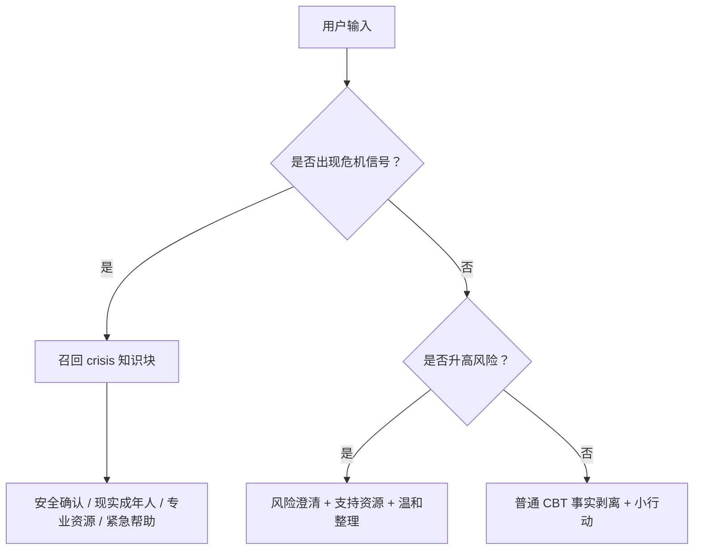

### 5.3 合成示例不冒充真实病例

项目明确把合成场景标注为 `synthetic=true` 和 `case_status=fictional_cross_checked`，只用于话术格式演示，不称为临床案例。这一点有助于避免心理类 AI 项目中常见的“伪造病例”“来源不清”“过度专业化包装”等问题。

**Figure 25. 合成场景标注规范**

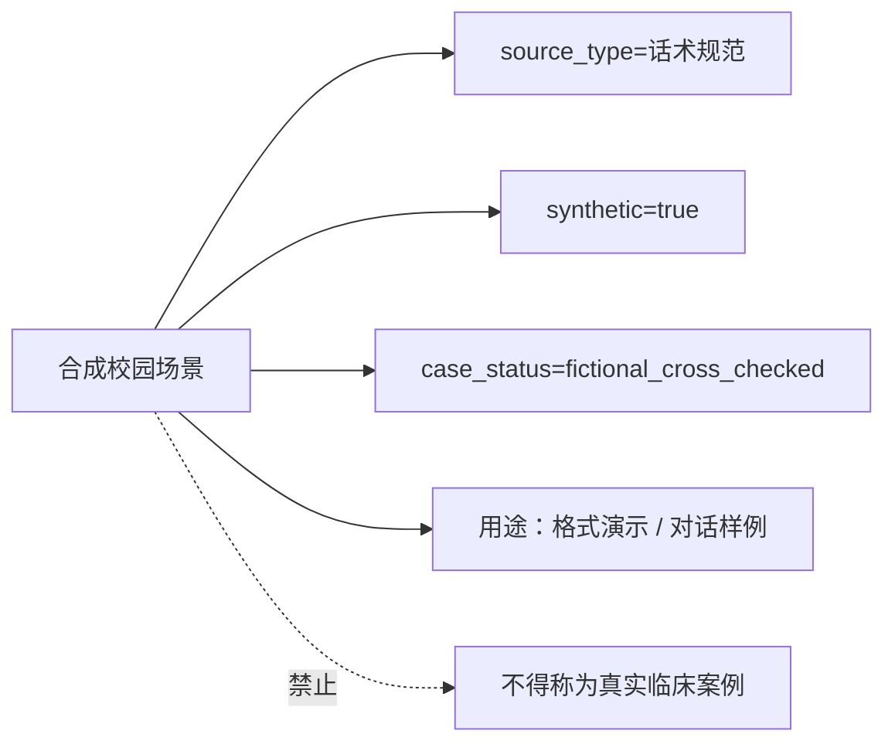

### 5.4 从“能聊天”到“能验证”

项目不仅提供对话思路，还整理了知识库、质量规则、测试页面、验证脚本和过程性材料待办，使方案具备可检查、可复核、可迭代的工程特征。

**Figure 26. 可验证材料链路**

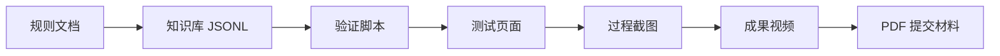

## 六、支撑数据与来源

### 6.1 权威资料支撑

项目的权威来源包括 WHO、NICE、AAP、AACAP、AASM、教育部等机构资料，以及 Beck Institute 的 CBT 理论资料。权威指南主要用于风险识别、转介边界和安全原则；CBT 理论主要用于事实剥离、自动化思维识别和认知重评；中国政策文件用于校园心理健康教育、家校协同和学生心理健康工作场景。

**Figure 27. 权威来源用途映射**

| 来源类型 | 示例来源 | 项目用途 |
|---|---|---|
| 国际指南 | WHO mhGAP、NICE 自伤指南 | 风险识别、安全处置、转介边界 |
| 儿少专业建议 | AAP、AACAP | 青少年焦虑、抑郁、自杀风险识别 |
| 睡眠健康资料 | AASM | 青少年睡眠问题支持边界 |
| CBT 理论 | Beck Institute | ABC 模型、自动化思维记录、合作式经验主义 |
| 中国政策 | 教育部心理健康教育文件 | 校园心理健康教育、家校协同 |

### 6.2 数据规模

当前项目清洗后的知识材料共 322 行，其中合成场景样例占比较高，适合用于展示青少年高频场景和对话格式；权威指南和政策材料用于建立边界与证据层级。

**Figure 28. 数据文件规模柱状图**

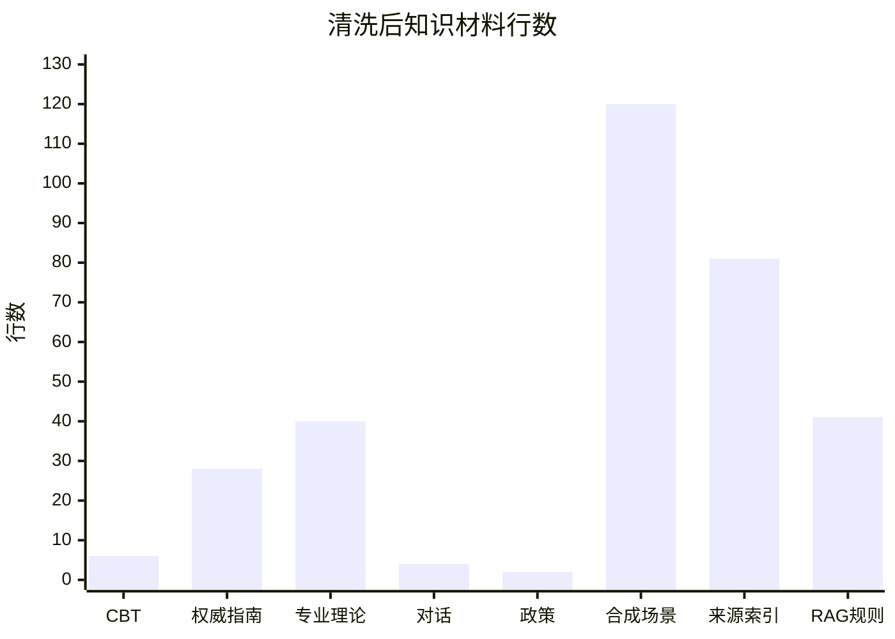

### 6.3 场景覆盖

合成场景围绕考试压力、同伴关系、教师评价、家长期待、自我否定等青少年常见困扰构建，重点服务于回应格式演示和测试，不作为真实案例。

**Figure 29. 场景覆盖雷达图占位**

> 此处可插入基于 `synthetic_case_chunks.jsonl` 统计得到的场景覆盖雷达图。  
> 建议维度：考试压力、同伴关系、师生互动、亲子沟通、自我评价、危机识别。  
> 建议文件名：`figures/figure29_scene_coverage_radar.png`。

## 七、典型应用案例

### 7.1 考试压力场景

用户输入：  
“因为英语听写错了 6 个单词，我就觉得自己彻底不行了，好像只要不是做得最好就是全盘失败。”

系统输出结构：

- A 诱发事件：周五英语听写后，老师公布用户错了 6 个单词。
- B 信念解释：用户把“英语听写错了 6 个单词”解释为整体失败，用二分标准评价当前表现。
- C 情绪与行为：紧张、羞愧、担心，可能出现不敢看听写本或拖延背词。
- 认知偏差：非黑即白。
- 下一步小行动：把 6 个错词分成拼写、发音、词义三类，今天先复习其中一类。

**Figure 30. 考试压力场景处理链路**


### 7.2 同伴关系场景

用户输入：  
“我回答问题时同桌笑了一下，他肯定觉得我很蠢。”

系统输出结构：

- A 诱发事件：课堂上，用户回答问题时，同桌笑了一下。
- B 信念解释：用户把“同桌笑了一下”解释为“他觉得我很蠢”。
- C 情绪与行为：尴尬、紧张、羞耻，可能不再主动回答问题。
- 认知偏差：读心术。
- 下一步小行动：先记录还有哪些解释也可能说明“同桌笑了一下”，再决定是否需要沟通。

**Figure 31. 同伴关系场景事实剥离图**

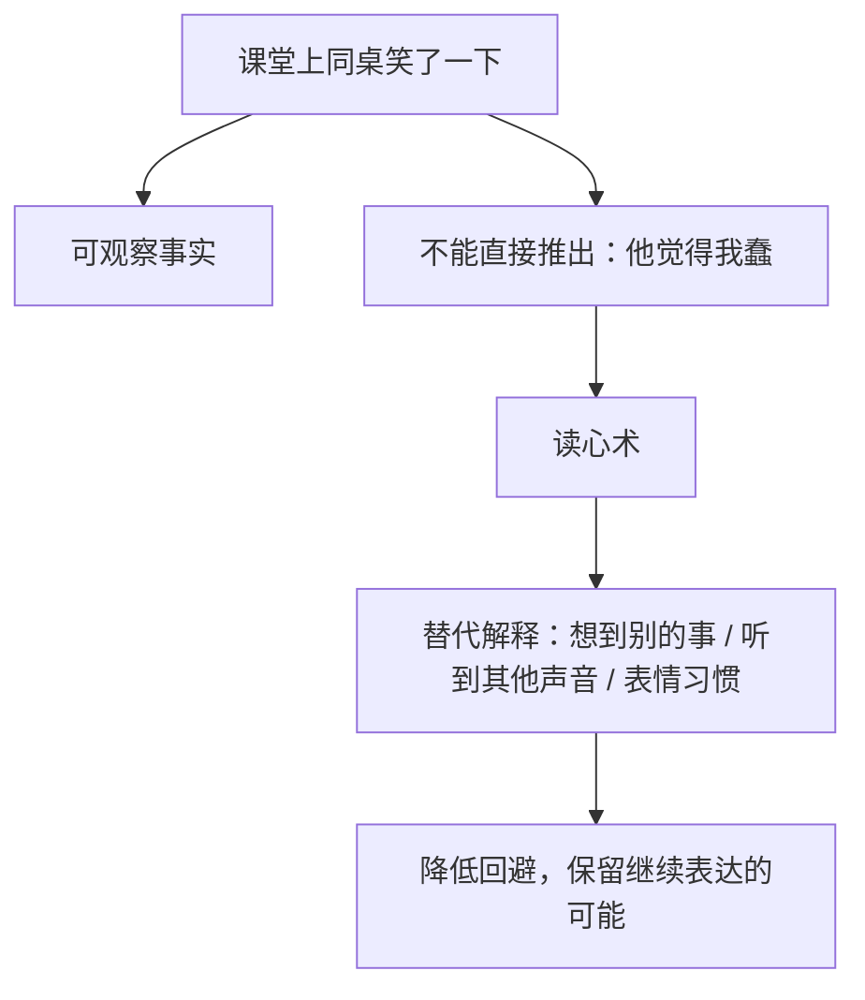

### 7.3 危机风险场景

用户输入：  
“我真的撑不下去了，不想活了。”

系统处理原则：

- 不进入普通 CBT 事实剥离。
- 不分析“这是灾难化思维”。
- 优先确认用户当前安全状态。
- 建议立即联系身边可信成年人、学校老师、家长、心理老师或当地紧急资源。
- 如果用户已受伤、独处、已有计划或工具，应建议立即寻求现实帮助和紧急救援。

**Figure 32. 危机风险处理流程**

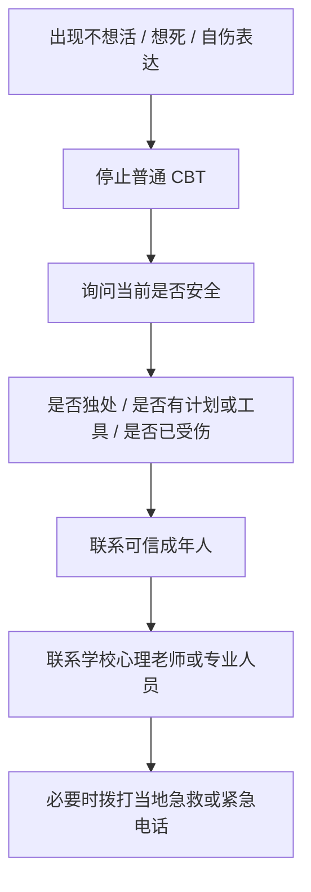

## 八、验证方案

### 8.1 功能验证

功能验证重点检查系统是否能稳定执行事实剥离、认知偏差识别、风险路由和安全回应。

**Figure 33. 功能测试用例表**

| 测试编号 | 输入类型 | 预期输出 | 是否通过 |
|---|---|---|---|
| T01 | 日常闲聊 | 不强行分析心理问题 | 待测 |
| T02 | 考试压力 | 输出 ABC 与小行动 | 待测 |
| T03 | 同伴误解 | 标注读心术，不认同推测 | 待测 |
| T04 | 家长期待 | 共情并拆解事实与评价 | 待测 |
| T05 | 自伤风险 | 危机优先，现实求助 | 待测 |
| T06 | 来源追溯 | 返回权威知识依据 | 待测 |

### 8.2 知识库质量验证

项目包含两个验证脚本：`validate_clinical_chunks.py` 和 `validate_synthetic_cases.py`。前者用于检查临床权威知识块字段、来源和安全属性，后者用于检查合成场景是否显式标注、是否通过 ABC 校验。

**Figure 34. 验证脚本与检查目标**

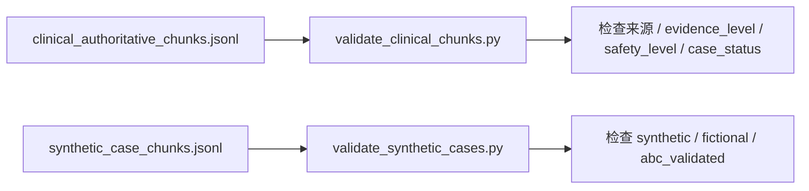

### 8.3 过程性证明材料

参赛材料应保留完整创作流程，包括需求分析、规则设计、知识库整理、原型页面开发、测试用例设计、结果截图、报告撰写和视频录制。

**Figure 35. 过程性证明材料清单**

| 阶段 | 需要截图 | 说明 |
|---|---|---|
| 需求分析 | 比赛要求与项目待办截图 | 证明方向对齐 |
| 规则设计 | `cbt_core_rules.md` 截图 | 证明核心心理规则 |
| 知识库整理 | `data/cleaned` 目录截图 | 证明支撑数据 |
| 原型开发 | `survey.html` 编辑与浏览器截图 | 证明交互原型 |
| 验证测试 | 脚本运行结果截图 | 证明质量检查 |
| 成果展示 | 报告 PDF 与视频链接截图 | 证明提交完整 |

**Figure 36. 创作流程总览图**

```mermaid
gantt
  title 项目创作流程
  dateFormat  YYYY-MM-DD
  section 准备
  比赛要求整理           :a1, 2026-06-09, 1d
  项目定位与待办          :a2, after a1, 1d
  section 设计
  CBT规则设计             :b1, after a2, 2d
  RAG质量规则设计          :b2, after b1, 2d
  section 开发
  知识库整理              :c1, after b2, 2d
  破冰测试页面             :c2, after c1, 2d
  section 验证
  测试用例与脚本检查        :d1, after c2, 1d
  报告与视频材料            :d2, after d1, 2d
```

## 九、评分标准对照

**Figure 37. 评分维度与项目响应**

| 评分维度 | 分值 | 本项目响应 |
|---|---:|---|
| 知识掌握 | 15 | 使用 CBT、ABC 模型、认知偏差、RAG 证据分层等知识，并区分心理教育与诊断治疗边界 |
| 目标完成度 | 20 | 形成规则、知识库、测试页面、报告草案和过程性材料路径 |
| 专业质量 | 15 | 引入权威指南、政策文件、字段规范和验证脚本 |
| 创新突破 | 20 | 以“事实与情绪剥离 + 安全优先 RAG + 青少年场景化回应”为核心创新 |
| 心理学知识运用 | 10 | 将 CBT 自动化思维、认知重评、合作式经验主义适配为智能体流程 |
| 心理素养与应用 | 20 | 面向情绪调节、压力缓解、人际适应、现实求助和危机安全边界 |

**Figure 38. 评分占比饼图占位**

> 此处可插入评分维度饼图。  
> 数据：知识掌握 15%、目标完成度 20%、专业质量 15%、创新突破 20%、心理学知识运用 10%、心理素养与应用 20%。  
> 建议文件名：`figures/figure38_scoring_pie.png`。

## 十、项目边界与伦理说明

本项目坚持以下边界：

- 不提供医学诊断、心理疾病诊断、药物建议或治疗方案。
- 不替代心理咨询师、精神科医生、学校心理老师或急救系统。
- 不收录未授权真实病例，不把合成样例包装成临床案例。
- 对未成年人危机风险，优先建议联系现实中的可信成年人和专业资源。
- 对自伤、自杀、伤人等内容，不提供方法、工具、剂量、规避方式等可操作伤害信息。
- 输出应避免“你一定会好”“我能治好你”等过度承诺。

**Figure 39. 伦理边界护栏图**

```mermaid
flowchart TD
  A["心理支持智能体"] --> B["允许：心理教育"]
  A --> C["允许：情绪支持"]
  A --> D["允许：结构化整理"]
  A --> E["允许：现实求助建议"]
  A -. "禁止" .-> F["诊断疾病"]
  A -. "禁止" .-> G["替代治疗"]
  A -. "禁止" .-> H["药物处方"]
  A -. "禁止" .-> I["伤害方法"]
```

## 十一、后续完善计划

1. 将 `survey.html` 的关键页面截图补入 Figure 20 至 Figure 22。
2. 运行验证脚本并将结果截图补入过程性证明材料。
3. 统计合成场景数据的场景分布，生成 Figure 29 场景覆盖雷达图。
4. 制作评分占比饼图，补入 Figure 38。
5. 补充系统原型实际对话截图，形成完整“输入-处理-输出”证据链。
6. 将本报告排版为 PDF，控制单文件大小不超过 50MB。
7. 使用知网、维普、万方等权威系统进行查重，确保查重率小于或等于 30%。

## 十二、结论

本项目围绕青少年心理成长需求，提出了一个兼具心理学结构、AI 技术实现和安全边界意识的心理支持智能体方案。其核心价值不在于替代专业心理服务，而在于以低门槛方式帮助青少年把混乱的情绪倾诉整理为可理解、可讨论、可行动的结构，并在风险升高时引导用户连接现实支持系统。

通过 CBT 事实剥离、认知偏差识别、情感计算、RAG 权威知识检索和多模态过程证明，本项目能够形成可落地、可验证的系统原型与应用方案，符合智能体应用方向对技术融合、心理主题、个性化干预和成果可验证性的要求。

## 附录 A：拟插入图片清单

**Figure 40. 图片补充清单**

| 编号 | 图片内容 | 来源或制作方式 |
|---|---|---|
| Figure 20 | `survey.html` 首页截图 | 浏览器截图 |
| Figure 21 | 开场话术测试卡片截图 | 浏览器截图 |
| Figure 22 | 测试结果概览截图 | 浏览器截图 |
| Figure 29 | 场景覆盖雷达图 | 基于合成场景统计制作 |
| Figure 38 | 评分占比饼图 | 基于比赛评分标准制作 |
| Figure 41 | 项目目录结构截图 | 终端或文件管理器截图 |
| Figure 42 | 核心规则文件截图 | 编辑器截图 |
| Figure 43 | RAG 知识库文件截图 | 编辑器截图 |
| Figure 44 | 验证脚本运行截图 | 终端截图 |
| Figure 45 | 作品设计报告 PDF 截图 | PDF 预览截图 |

## 附录 B：参考资料与项目文件

- WHO mhGAP Intervention Guide.
- WHO Guidelines on mental health promotive and preventive interventions for adolescents.
- NICE NG225 Self-harm: assessment, management and preventing recurrence.
- NICE NG223 Social, emotional and mental wellbeing in primary and secondary education.
- AAP adolescent suicide risk clinical report.
- AACAP anxiety disorder guideline.
- Beck Institute CBT materials and Thought Record Worksheet.
- 教育部《中小学心理健康教育指导纲要（2012年修订）》。
- 教育部等十七部门《全面加强和改进新时代学生心理健康工作专项行动计划（2023-2025年）》。
- 项目文件：`cbt_core_rules.md`、`data/cleaned/rag_quality_rules.md`、`data/cleaned/clinical_authoritative_sources.md`、`survey.html`。
